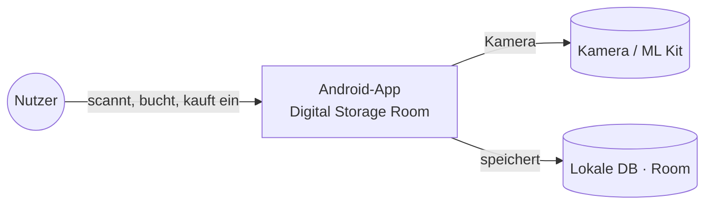
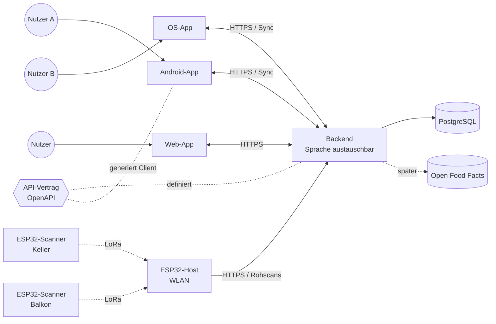
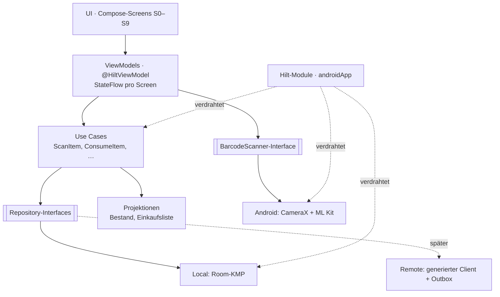
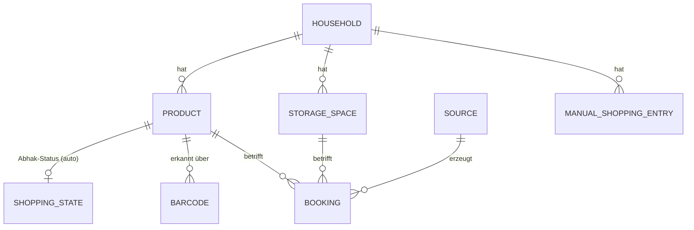
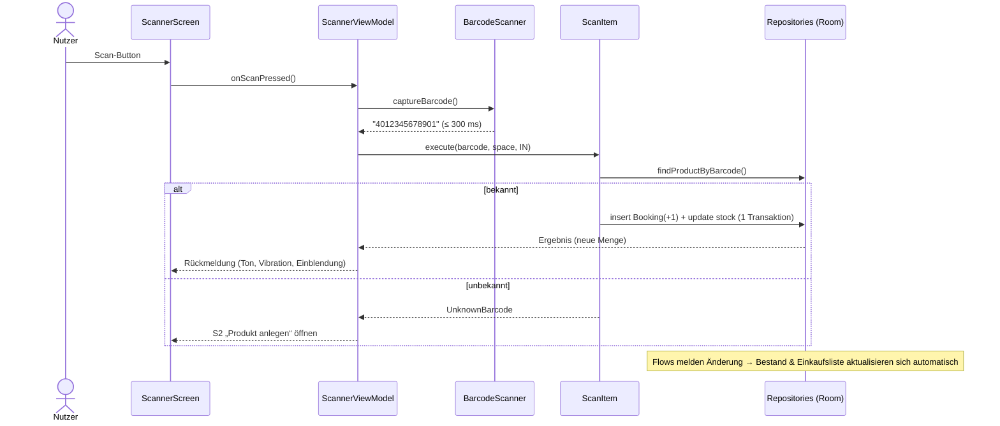
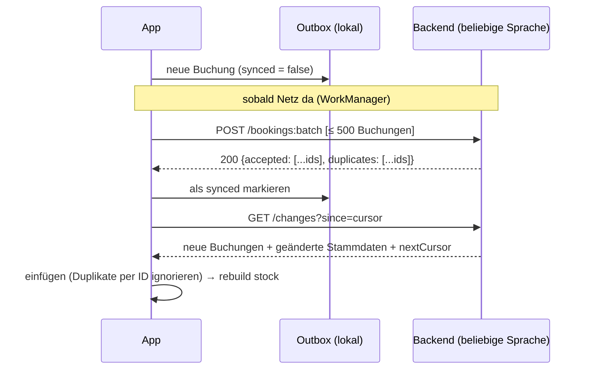
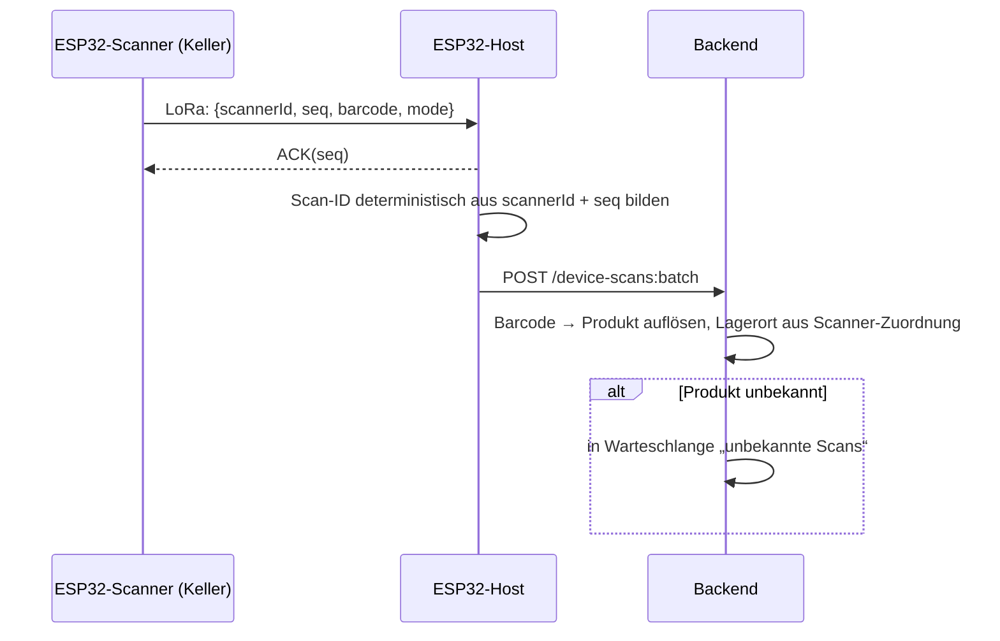

# Digital Storage Room – Architektur

> Stand: 27.09.2026 · Version 0.2 · Struktur angelehnt an arc42 (verschlankt)
> Grundlage: Feature-Katalog v0.3, User Stories MVP, Bildschirme & Abläufe
> Verweise: Features (z. B. EK-2), Entscheidungen (E-x), Designentscheidungen (D-x), Architekturentscheidungen (ADR-x)
>
> This was generated with the help of Opus 5.5

## 1. Ziele und Rahmen

### 1.1 Qualitätsziele

| Prio | Ziel | Messbar durch | Bezug |
|---|---|---|---|
| 1 | **Verlässlicher Bestand:** Keine Buchung geht verloren oder wird doppelt gezählt | Absturz-/Offline-Tests, idempotenter Sync | NF-4, NF-5 |
| 2 | **Offline-first:** Alles funktioniert ohne Netz | Alle Kernabläufe im Flugmodus | OF-1 |
| 3 | **Schnelle Bedienung:** Scan bis Buchung ≤ 0,5 s | Messung auf Referenzgerät | NF-1, NF-3 |
| 4 | **Erweiterbarkeit:** Backend, mehrere Geräte, iOS/Web, Hardware-Scanner ohne Umbau | Neue Quelle = neue Implementierung einer Schnittstelle | E-6, MU-* |
| 5 | **Austauschbarkeit:** App und Backend sind technologisch unabhängig und nur über einen dokumentierten Vertrag gekoppelt | Backend lässt sich in anderer Sprache (z. B. Rust) neu bauen, ohne die App zu ändern | ADR-9 |
| 6 | **Testbarkeit:** Fachlogik ohne Android testbar, Datenschicht 100 % Abdeckung | Coverage-Report | requirements.md |

### 1.2 Randbedingungen

- Ein Entwickler, Freizeitprojekt: **KISS** vor Vollständigkeit. Nur bauen, was das MVP braucht. Erweiterungspunkte vorsehen, aber nicht implementieren.
- MVP: **Android**, ein Nutzer, ein Gerät, **kein Backend** (E-6).
- Später: iOS, Web, mehrere Nutzer/Haushalte, ESP32-Scanner über LoRa und ESP32-Host (E-11).
- Backend portabel als Container. Ziel offen (Home-Cluster oder Cloud). **Backend-Sprache offen** (Start mit Kotlin/Ktor, Wechsel z. B. auf Rust möglich).
- **Kein Zwang zum Monorepo.** App, Backend, Firmware und API-Vertrag können in getrennten Repositories leben.

## 2. Kontext

### 2.1 MVP



### 2.2 Zielbild



Alle Teilnehmer sprechen gegen **einen sprachneutralen API-Vertrag** (ADR-9). Wie das Backend implementiert ist, ist für die Clients unsichtbar.

## 3. Lösungsstrategie

| Thema | Ansatz | ADR |
|---|---|---|
| Plattform | **Kotlin Multiplatform (KMP)** für die *App-interne* Fachlogik und Datenhaltung (Android heute, iOS später). UI: Jetpack Compose, nur Android. | ADR-1 |
| Kopplung App ↔ Backend | **Contract-first:** Ein OpenAPI-Dokument ist die einzige gemeinsame Wahrheit. Kein geteilter Code zwischen App und Backend. | ADR-9 |
| Datenhaltung | **Buchungen sind ein unveränderliches Log.** Bestand und Einkaufsliste werden daraus abgeleitet (Projektion). Stammdaten (Produkte, Lagerorte) sind normale, änderbare Datensätze. | ADR-2 |
| IDs | **UUIDv7, auf dem Gerät erzeugt** | ADR-3 |
| Konflikte | Buchungen sind Deltas (+n/−n) und damit **kommutativ**. Es gibt keine Konflikte. Stammdaten: Last-Writer-Wins pro Feld. **Kein Operational Transformation nötig.** | ADR-4 |
| Erweiterungspunkt | **Repository-Interfaces** im Domain-Modul. Lokale Implementierung im MVP, Sync-Implementierung später. | ADR-5 |
| Backend | Start mit **Ktor + PostgreSQL** als Container. Austauschbar, solange der Vertrag erfüllt wird. | ADR-6 |
| Hardware | ESP32-Host übersetzt LoRa → REST. Die API wird nicht an LoRa angepasst. | ADR-7 (= E-11) |
| Lokale DB | **Room (KMP)** | ADR-8 |
| DI | **Hilt** in der Android-App. Shared-Code ohne DI-Framework (reine Konstruktor-Injektion). | ADR-10 |

## 4. Bausteinsicht

### 4.1 Repositories und Module

Die Teile sind **unabhängig versionierbar** und können in getrennten Repositories liegen. Für den Start ist ein gemeinsames Repo bequem, aber nicht nötig.

```
dsr-api-contract/               ← eigenes Repo (oder Ordner), sprachneutral
├── openapi.yaml                Endpunkte, Schemas (Booking, Product …)
├── examples/                   Beispiel-Payloads (dienen auch als Testdaten)
└── CHANGELOG.md                Versionen des Vertrags (SemVer)

dsr-app/                        ← App-Repo (KMP)
├── shared/
│   ├── domain/                 reines Kotlin, keine Abhängigkeiten
│   │   ├── model/              Product, StorageSpace, Booking, ShoppingEntry …
│   │   ├── projection/         StockProjection, ShoppingListProjection
│   │   ├── usecase/            ScanItem, ConsumeItem, UndoBooking, SaveCorrections …
│   │   └── repository/         Interfaces (BookingRepository, ProductRepository …)
│   └── data/
│       ├── local/              Room-KMP: Entities, DAOs, Repository-Implementierungen
│       └── remote/             (später) aus openapi.yaml generierter Client + Mapper + Outbox
├── androidApp/                 Compose-UI, ViewModels, Navigation, Hilt-Module, CameraX + ML Kit
└── docs/                       features.md, stories/, architecture.md, adr/

dsr-backend/                    ← eigenes Repo, Sprache frei (Start: Kotlin/Ktor)
dsr-firmware/                   ← eigenes Repo (ESP32-Scanner + Host)
```

**Abhängigkeitsregeln**
- In der App: `androidApp → shared.domain ← shared.data`. Die Domain kennt keine Datenbank, kein Android, kein Netzwerk.
- **App und Backend hängen nur am Vertrag**, nie aneinander. Die App bildet die generierten DTOs in ihr eigenes Domain-Modell ab (Mapper in `data/remote`). Dadurch kann sich das API-Format ändern, ohne dass die Domain betroffen ist.

### 4.2 Schichten in der App



| Baustein | Verantwortung |
|---|---|
| **Use Cases** | Eine fachliche Aktion = ein Use Case. Prüfen Regeln (z. B. „kein Entnehmen bei Bestand 0“, EN-1 AK-3) und erzeugen Buchungen. |
| **Projektionen** | Berechnen Bestand pro Produkt × Lagerort und die automatische Einkaufsliste aus Buchungen + Mindestbestand. Reine Funktionen, vollständig unit-testbar. |
| **Repositories** | Lesen/Schreiben von Buchungen und Stammdaten. Liefern `Flow`s, damit die UI live aktualisiert (EK-2 AK-4). |
| **BarcodeScanner** | Kapselt Kamera und Erkennung. Liefert „Barcode im Zielrahmen“ auf Anfrage (Scan-Button, E-7). Austauschbar für iOS und den späteren Dauerscan (SC-7). |
| **Hilt-Module** | Liegen ausschließlich in `androidApp`. Erzeugen die Klassen aus `shared` per `@Provides` (siehe ADR-10). |

## 5. Datenmodell

### 5.1 Übersicht



`HOUSEHOLD` gibt es im MVP genau einmal (lokal erzeugt). Damit ist Multi-Tenancy (MU-7) im Modell bereits angelegt.

### 5.2 Buchung (Kern)

| Feld | Typ | Beschreibung |
|---|---|---|
| `id` | UUIDv7 | Weltweit eindeutig, auf dem Gerät erzeugt, zeitlich sortierbar. Dient als **Idempotenzschlüssel** beim Sync. |
| `householdId` | UUID | Mandant |
| `productId` | UUID | |
| `storageSpaceId` | UUID | |
| `delta` | Int | +n Einbuchen, −n Entnehmen. Nie 0. |
| `type` | Enum | `IN`, `OUT`, `CORRECTION`, `REVERSAL`, `MOVE_OUT`, `MOVE_IN` |
| `reversesId` | UUID? | Bei `REVERSAL`: die zurückgenommene Buchung (SC-4, EN-2) |
| `correlationId` | UUID? | Fasst zusammengehörige Buchungen zusammen (Umlagern, Lagerort löschen, Speichern im Bearbeitungsmodus) |
| `sourceId` | String | Gerät, das gebucht hat (App-Installation, später ESP32-Scanner-ID) |
| `occurredAt` | Instant | Zeitpunkt auf dem Gerät |
| `receivedAt` | Instant? | Zeitpunkt im Backend (später) |

**Regeln**
- Buchungen werden **nie geändert oder gelöscht** (NF-5). Korrektur = neue Buchung.
- Umlagern und Lagerort-Verschieben (LO-4) = `MOVE_OUT` + `MOVE_IN` mit gleicher `correlationId`, in einer Transaktion.
- Bearbeitungsmodus speichern (BE-4) = eine `CORRECTION` pro geändertem Produkt mit der Differenz. Bei Differenz 0 keine Buchung (BE-4 AK-6).

### 5.3 Stammdaten

| Entität | Wichtige Felder | Hinweise |
|---|---|---|
| `StorageSpace` | id, name, type, sortIndex, deletedAt?, updatedAt | Löschen = Soft-Delete, damit alte Buchungen gültig bleiben |
| `Product` | id, name, nameNormalized, minStock (≥ 0), photoRef?, deletedAt?, updatedAt | `minStock` steht hier (E-2). `nameNormalized` für die Suche. |
| `Barcode` | code, productId | Mehrere Barcodes pro Produkt möglich (PR-1 AK-8, PR-4). Ein Barcode ist **pro Haushalt** eindeutig. |
| `ManualShoppingEntry` | id, text, productId?, quantity, checked, updatedAt | EK-3 |
| `ShoppingState` | productId, checked, checkedAt | Abhak-Status automatischer Einträge (EK-4, E-10) |

### 5.4 Projektionen

**Bestand** (pro Produkt × Lagerort):

$$\text{bestand}(p, l) = \sum_{b \,\in\, \text{Buchungen}(p, l)} b.\text{delta}$$

**Einkaufsliste** (automatischer Teil, E-2):

$$\text{fehlt}(p) = \max\left(0,\; \text{minStock}(p) - \sum_{l} \text{bestand}(p, l)\right)$$

Ein Produkt steht auf der Liste, wenn $$\text{fehlt}(p) > 0$$. Wird $$\text{fehlt}(p) = 0$$, wird sein `ShoppingState` zurückgesetzt (EK-2 AK-5).

**Umsetzung im MVP:** Die Datenbank führt eine Tabelle `stock(productId, storageSpaceId, quantity)`. Sie wird **in derselben Transaktion** aktualisiert wie die neue Buchung. So bleiben Abfragen schnell. Die Tabelle lässt sich jederzeit aus dem Log neu berechnen (`rebuildStock()`, z. B. nach Import oder Sync). Ein Test prüft: Neuberechnung = inkrementeller Stand.

**Negativer Bestand:** Lokal verhindern die Use Cases ihn (EN-1 AK-3). Später können aber zwei Geräte offline dasselbe letzte Stück entnehmen. Die Projektion rechnet dann ehrlich mit −1. Die UI zeigt 0 und markiert „Bestand prüfen“ (Grundlage für EN-5). Buchungen werden dabei nie verworfen.

### 5.5 Fotos (A-4)

- Optional pro Produkt (PR-1, PR-5). Aufnahme über die Kamera im Formular „Produkt anlegen“.
- Speicherung als **komprimiertes JPEG/WebP** (z. B. max. 1024 px Kantenlänge) im App-internen Speicher. In der DB steht nur `photoRef` (Dateiname).
- Beim Löschen eines Produkts wird die Datei mit entfernt.
- Im Export (OF-6) werden Fotos optional mitgesichert. Später Upload in einen Objektspeicher. Das Format steht im API-Vertrag.

## 6. Laufzeitsicht

### 6.1 Scan im Modus Einbuchen (SC-2, PR-1)



### 6.2 Rückgängig (SC-4, EN-2)

Die UI hält pro Scan-Sitzung einen Stapel von Buchungs-IDs (D-4). „Rückgängig“ erzeugt eine `REVERSAL`-Buchung mit `delta = −original.delta` und `reversesId`. Eine Buchung kann nur einmal zurückgenommen werden (wird im Use Case geprüft).

### 6.3 Sync (später, OF-5)



- **Idempotenz:** Das Backend speichert Buchungen per `id` mit `ON CONFLICT DO NOTHING`. Ein wiederholter Upload richtet keinen Schaden an (wichtig auch für den ESP32-Host).
- **Batching:** Buchungen werden gesammelt gesendet (technical.md).
- **Cursor** = fortlaufende Server-Sequenz, nicht die Gerätezeit. So wird nichts übersehen, auch bei falsch gehenden Uhren.
- **Live-Updates** (MU-4): später per WebSocket/SSE „es gibt Neues“. Danach holt die App `GET /changes`.

### 6.4 ESP32-Scanner (später, MU-9/MU-10)



- Der Scanner sendet **Barcode statt Produkt-ID**. Er kennt keine Stammdaten. Das Backend löst den Barcode auf (OF-2 AK-5).
- **Deterministische Scan-ID** (UUIDv5 aus `scannerId + seq`): Funk-Wiederholungen erzeugen dieselbe ID und werden dadurch vom Backend verworfen. Das ist die bewusste Ausnahme von UUIDv7 (ADR-3). Die daraus entstehende Buchung bekommt im Backend eine UUIDv7 und verweist auf die Scan-ID.
- Der Host braucht dafür einen eigenen Endpunkt, der **Rohscans** annimmt. Die Buchungs-Schnittstelle selbst bleibt unverändert (E-11).

## 7. API-Vertrag (später)

Der Vertrag liegt als **`openapi.yaml`** im Repo `dsr-api-contract` (ADR-9). Er ist die einzige Quelle für Endpunkte und Datenformate. Die folgende Tabelle ist nur eine Skizze.

| Methode | Pfad | Zweck |
|---|---|---|
| `POST` | `/v1/households/{id}/bookings:batch` | Buchungen hochladen (idempotent) |
| `GET` | `/v1/households/{id}/changes?since={cursor}` | Buchungen + Stammdaten-Änderungen seit Cursor |
| `PUT` | `/v1/households/{id}/products/{productId}` | Produkt anlegen/ändern (LWW über `updatedAt`) |
| `PUT` | `/v1/households/{id}/storage-spaces/{id}` | Lagerort anlegen/ändern |
| `POST` | `/v1/devices/{deviceId}/scans:batch` | Rohscans von ESP32-Host |
| `GET` | `/v1/households/{id}/unresolved-scans` | Warteschlange unbekannter Barcodes |

Beispiel-Buchung:

```json
{
  "id": "01923f6e-7a1c-7b2e-9a55-0f2d8e7b9c11",
  "productId": "01923f5d-…",
  "storageSpaceId": "01923f4a-…",
  "delta": -1,
  "type": "OUT",
  "reversesId": null,
  "correlationId": null,
  "sourceId": "android-7f3e",
  "occurredAt": "2026-09-27T18:42:10.123Z"
}
```

**Regeln für den Vertrag**
- **Versionierung:** URL-Präfix `/v1`. Der Vertrag selbst wird nach SemVer versioniert.
- **Abwärtskompatibel erweitern:** Neue Felder sind optional. Clients ignorieren unbekannte Felder. Breaking Changes nur mit `/v2`.
- **Code-Generierung:** Die App generiert ihren Client aus `openapi.yaml` (z. B. OpenAPI Generator, Ktor-Client + kotlinx.serialization). Das Backend generiert Server-Stubs oder prüft sich per Contract-Test gegen den Vertrag (Kotlin: Ktor-Plugin, Rust: z. B. `utoipa` / `progenitor` / `oapi-codegen`-Äquivalente).
- **Contract-Tests:** Die Beispiel-Payloads in `examples/` werden in App- und Backend-Tests gegen das Schema validiert. So fällt eine Abweichung in der CI auf, egal in welcher Sprache das Backend geschrieben ist.

## 8. Querschnittliche Konzepte

| Thema | Konzept |
|---|---|
| **Reaktive UI** | Room → `Flow` → ViewModel `StateFlow` → Compose. Keine manuellen Refreshes. Einkaufslisten-Badge, Bestand und Suche aktualisieren sich automatisch. |
| **Transaktionen** | Jeder Use Case, der Buchungen erzeugt, läuft in genau einer DB-Transaktion (Buchung(en) + `stock`). Grundlage für NF-4. |
| **Zeit** | `kotlinx-datetime`, UTC speichern, lokal anzeigen. Eine `Clock` wird injiziert (testbar). |
| **Dependency Injection** | **Hilt** in `androidApp`. Klassen in `shared` nutzen reine Konstruktor-Injektion ohne Annotationen und werden in Hilt-Modulen per `@Provides` bereitgestellt (ADR-10). |
| **Suche** | Normalisierte Namensspalte (klein, Umlaute → ae/oe/ue, ß → ss) für „kase“ → „Käse“ (BE-3 AK-2). Ergebnis mit Verteilung über Lagerorte aus `stock` (D-5). |
| **Mehrsprachigkeit** | Android `strings.xml` im MVP. Keine Texte im Code (todo.md, NF-6). |
| **Fotos** | Siehe 5.5 |
| **Backup (OF-6)** | Export = Buchungs-Log + Stammdaten (+ optional Fotos) als JSON/ZIP. **Format = Schemas aus dem API-Vertrag.** Import = einfügen + `rebuildStock()`. |
| **Sicherheit (später)** | OIDC (z. B. Keycloak oder Entra), Mandantentrennung über `householdId` in jeder Abfrage. Geräte-Token für den ESP32-Host. |

## 9. Architekturentscheidungen (ADR)

> Kurzform. Jede ADR wird bei Bedarf als eigene Datei unter `docs/adr/` abgelegt.

### ADR-1: Kotlin Multiplatform für die App, Compose-UI nur Android
- **Kontext:** MVP Android, später iOS. Vorhandene Android-/Kotlin-Erfahrung.
- **Entscheidung:** KMP für Domain und Datenhaltung der **App** (Android + später iOS). UI mit Jetpack Compose nur für Android. **Kein Compose Multiplatform im MVP (A-2).** iOS bekommt später eine eigene UI (z. B. SwiftUI) auf Basis von `shared`.
- **Abgrenzung:** `shared` wird **nicht** mit dem Backend geteilt (siehe ADR-9).
- **Konsequenzen:** + Fachlogik einmal schreiben und testen. − Kamera/ML Kit plattformspezifisch (hinter Interface). − Etwas mehr Build-Komplexität als ein reines Android-Projekt.

### ADR-2: Buchungs-Log mit abgeleitetem Bestand (Eventsourcing light)
- **Kontext:** Nachvollziehbarkeit (NF-5), spätere Statistik (ST-*), Zusammenführen mehrerer Quellen.
- **Entscheidung:** Nur **Bestandsänderungen** sind unveränderliche Events. Stammdaten sind normale Datensätze. Bestand wird als Projektion gepflegt und ist jederzeit neu berechenbar.
- **Verworfen:** Volles Eventsourcing (zu aufwendig für Stammdaten), CRUD mit Bestandszahl (keine Historie, Sync-Konflikte).
- **Konsequenzen:** + Historie und Prognosen „gratis“. + Sync ohne Konflikte. − Fehler werden durch Gegenbuchungen korrigiert, nicht durch Überschreiben.

### ADR-3: Clientseitig erzeugte UUIDv7
- **Entscheidung (A-3):** Alle IDs sind **UUIDv7** und werden auf dem Gerät erzeugt. Sie sind zeitlich sortierbar, was Indizes, Logs und das Debugging erleichtert.
- **Ausnahme:** Rohscans der ESP32-Scanner bekommen eine deterministische **UUIDv5** aus `scannerId + seq`, damit Funk-Wiederholungen erkannt werden (6.4).
- **Konsequenzen:** + Offline anlegen ohne Server. + Idempotenter Sync. − UUIDv7 enthält den Erzeugungszeitpunkt (unkritisch).

### ADR-4: Keine Operational Transformation
- **Kontext:** technical.md schlägt OT (wie Google Docs) gegen gegenseitiges Überschreiben vor.
- **Entscheidung:** **Nicht nötig.** Bestandsänderungen sind Deltas. Ihre Summe ist unabhängig von der Reihenfolge, deshalb können zwei Geräte parallel buchen, ohne sich zu überschreiben (MU-6). Für Stammdaten reicht Last-Writer-Wins pro Feld.
- **Konsequenzen:** + Deutlich einfacher. − Gleichzeitiges Umbenennen desselben Produkts: Die letzte Änderung gewinnt (akzeptabel).

### ADR-5: Repository-Interfaces als Erweiterungspunkt, Outbox für Sync
- **Entscheidung:** Use Cases kennen nur Interfaces. Im MVP gibt es die lokale Implementierung. Sync kommt später als Outbox-Muster dazu (Spalte `synced` an Buchungen) und wird per WorkManager angestoßen.
- **Konsequenzen:** + MVP enthält keinen ungenutzten Netzwerkcode. + Sync lässt sich ohne Änderung der Use Cases ergänzen.

### ADR-6: Backend-Start mit Ktor + PostgreSQL, Sprache austauschbar
- **Entscheidung:** Erste Implementierung mit Ktor (Kotlin, leichtgewichtig, vertraute Sprache) und PostgreSQL, ausgeliefert als Docker-Image (arm64 + amd64, für Raspberry Pi und Cloud).
- **Austauschbarkeit:** Durch ADR-9 kann das Backend später z. B. **in Rust (axum + sqlx)** neu geschrieben werden. Bedingungen: Es erfüllt `openapi.yaml`, besteht die Contract-Tests und nutzt dasselbe DB-Schema oder migriert es.
- **Verworfen:** Spring Boot (schwerer, wenig Nutzen bei diesem Umfang), BaaS (Bindung, Eventsourcing schwer umsetzbar).
- **Hinweis:** Die Last ist sehr gering (wenige Buchungen pro Haushalt und Tag). Ein Sprachwechsel aus Performancegründen wird voraussichtlich erst bei sehr vielen Haushalten nötig. Die Option bleibt trotzdem offen.

### ADR-7: ESP32-Host als Gateway (= E-11)
- **Entscheidung:** LoRa endet am Host. Der Host spricht HTTPS mit einem Rohscan-Endpunkt. Die Buchungs-API bleibt unverändert.

### ADR-8: Room (KMP) als lokale Datenbank
- **Entscheidung (A-1):** Room mit KMP-Unterstützung (SQLite).
- **Begründung:** Vertraut aus der Android-Welt, Flows, Migrationen, KMP-fähig. Alternative SQLDelight wird nur bei Problemen mit iOS neu bewertet.

### ADR-9: Contract-first statt geteiltem Code zwischen App und Backend
- **Kontext:** Ein gemeinsames Kotlin-Modul für App und Backend würde zwei Abhängigkeiten schaffen: zum **Monorepo** (beide Seiten müssen dasselbe Modul einbinden) und zur **Sprache Kotlin** im Backend. Ein späterer Wechsel z. B. auf Rust wäre dann teuer.
- **Entscheidung:** Die Kopplung erfolgt **ausschließlich über einen sprachneutralen Vertrag (`openapi.yaml`)** in einem eigenen Repo bzw. Ordner. App und Backend generieren daraus ihre DTOs oder prüfen sich dagegen. Es gibt keinen geteilten Quellcode.
- **Verworfen:** Geteiltes `api-contract`-Kotlin-Modul (v0.1 dieses Dokuments). Protobuf/gRPC (für ESP32 und Web unnötig komplex, REST ist ausreichend).
- **Konsequenzen:** + Backend-Sprache frei wählbar. + Getrennte Repos und Release-Zyklen möglich. + Vertrag dient zugleich als Dokumentation. − Code-Generierung und Contract-Tests müssen in der CI eingerichtet werden. − Kleiner Mehraufwand durch Mapper DTO ↔ Domain in der App.

### ADR-10: Hilt für Dependency Injection in der Android-App
- **Kontext:** Hilt ist der Android-Standard, bietet `@HiltViewModel`, WorkManager- und Navigation-Integration und prüft den Abhängigkeitsgraphen beim Kompilieren. Hilt läuft aber **nur auf Android/JVM**, nicht in `commonMain`.
- **Entscheidung:** Hilt in `androidApp`. Klassen in `shared` (Use Cases, Repositories, Projektionen) haben **keine DI-Annotationen** und erhalten ihre Abhängigkeiten über den Konstruktor. Hilt-Module in `androidApp` erzeugen sie per `@Provides`.
- **Beispiel:**

```kotlin
// shared/domain – kein DI-Framework
class ScanItem(
    private val products: ProductRepository,
    private val bookings: BookingRepository,
    private val clock: Clock,
    private val ids: IdGenerator,
)

// androidApp – Hilt-Modul
@Module
@InstallIn(SingletonComponent::class)
object DomainModule {
    @Provides fun scanItem(
        products: ProductRepository,
        bookings: BookingRepository,
        clock: Clock,
        ids: IdGenerator,
    ) = ScanItem(products, bookings, clock, ids)
}
```

- **Konsequenzen:** + Bewährter Android-Standard, Fehler im Graphen werden beim Kompilieren gefunden. + `shared` bleibt frameworkfrei und leicht testbar. − Etwas Boilerplate in den Hilt-Modulen. − iOS braucht später eine eigene, einfache Verdrahtung (manuell oder z. B. kotlin-inject). Durch die reine Konstruktor-Injektion ist das wenig Aufwand.

## 10. Risiken und technische Schulden

| Risiko | Auswirkung | Maßnahme |
|---|---|---|
| Wachsendes Buchungs-Log | Neuberechnung wird langsam | `stock`-Tabelle inkrementell pflegen. Später Snapshots. Bei ~10 Buchungen/Tag sind es ca. 3 650 pro Jahr, also unkritisch. |
| Barcode-Erkennung bei schlechtem Licht | NF-1 verfehlt | Taschenlampe (SC-2 AK-8), Zielrahmen, Messung auf echten Geräten |
| KMP-Reife für iOS (Kamera, Room) | Mehraufwand bei iOS | Plattformcode hinter Interfaces. ADR-8 bei iOS-Start prüfen. |
| Vertrag und Implementierung laufen auseinander | Sync-Fehler erst im Betrieb | Contract-Tests in beiden CI-Pipelines (ADR-9) |
| Nutzer vergessen das Entnehmen | Bestand falsch, Einkaufsliste unzuverlässig | Fachlich: schnelle Wege (E-8, E-9). Später EN-5 „Stimmt das noch?“. |
| Schema-Änderungen nach Release | Datenverlust | Room-Migrationen mit Tests. Export/Backup (OF-6) früh nachziehen. |
| Fotos füllen den Speicher | Speicherplatz | Komprimierung und Größenbegrenzung (5.5) |

## 11. Geklärte Architekturfragen

| # | Frage | Entscheidung |
|---|---|---|
| A-1 | Room-KMP oder SQLDelight? | **Room** (ADR-8) |
| A-2 | Compose Multiplatform schon im MVP? | **Nein**, nur Android-Compose (ADR-1) |
| A-3 | UUIDv4 oder v7? | **UUIDv7**, Ausnahme UUIDv5 für ESP32-Rohscans (ADR-3) |
| A-4 | Fotos im MVP? | **Ja**, lokal, optional, komprimiert (5.5) |
| A-5 | Geteiltes Kotlin-Modul mit dem Backend? | **Nein**, Contract-first mit OpenAPI (ADR-9) |
| A-6 | DI-Framework? | **Hilt** in der Android-App, Shared-Code frameworkfrei (ADR-10) |

## 12. Glossar (technisch)

| Begriff | Bedeutung |
|---|---|
| **Projektion** | Aus dem Buchungs-Log abgeleiteter Zustand (Bestand, Einkaufsliste) |
| **Outbox** | Lokale Warteschlange noch nicht synchronisierter Buchungen |
| **Idempotent** | Mehrfaches Senden derselben Buchung hat dieselbe Wirkung wie einmaliges |
| **LWW** | Last-Writer-Wins: Bei konkurrierenden Änderungen gewinnt die zuletzt geschriebene |
| **Cursor** | Server-Sequenznummer für „gib mir alles seit …“ |
| **Contract-first** | Erst den sprachneutralen API-Vertrag festlegen, dann App und Backend dagegen implementieren |
| **Contract-Test** | Automatischer Test, ob eine Implementierung den API-Vertrag erfüllt |
