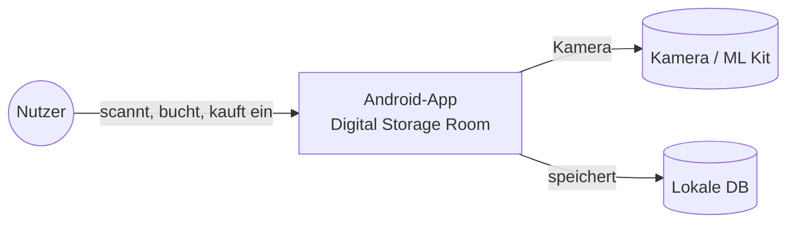
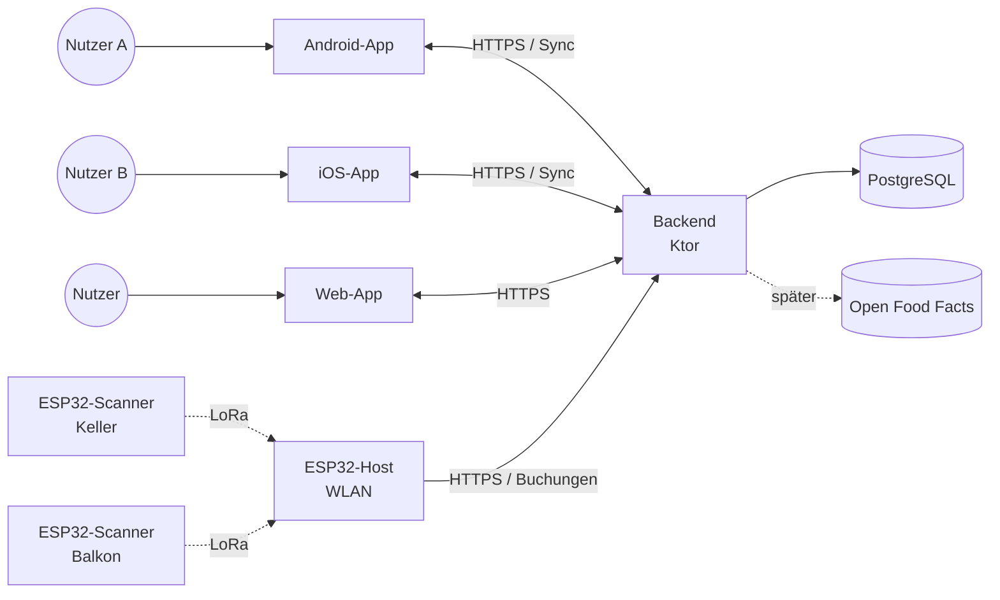
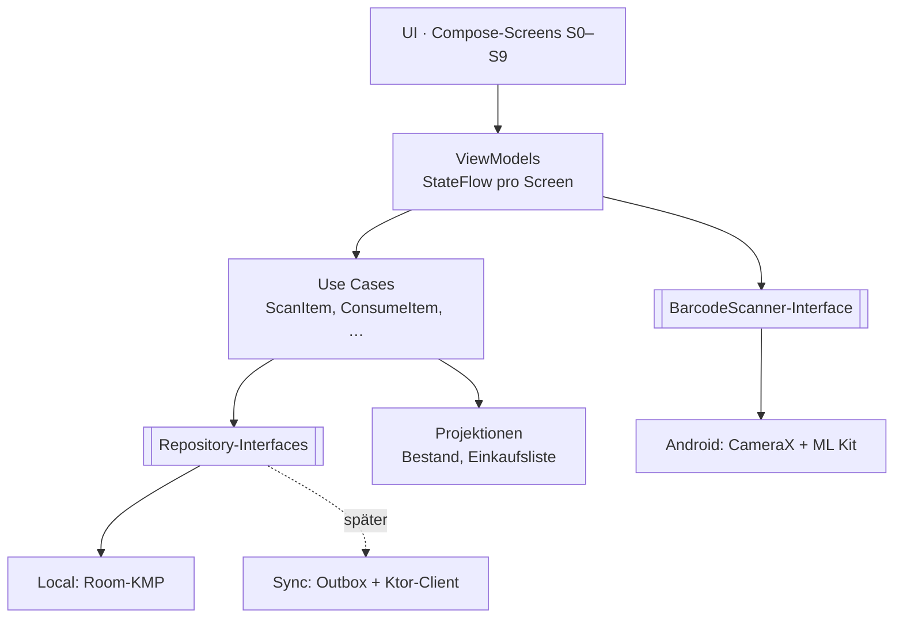
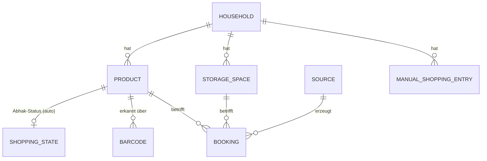
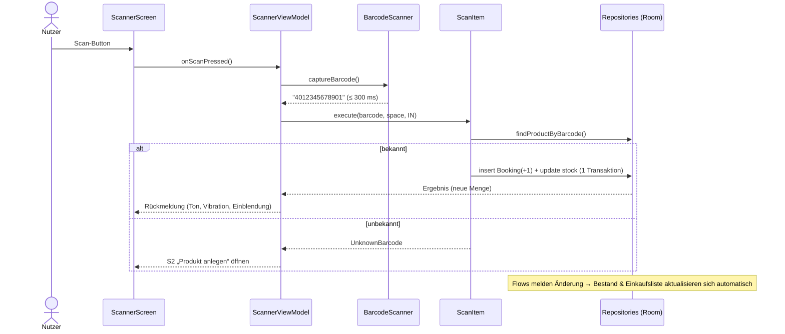
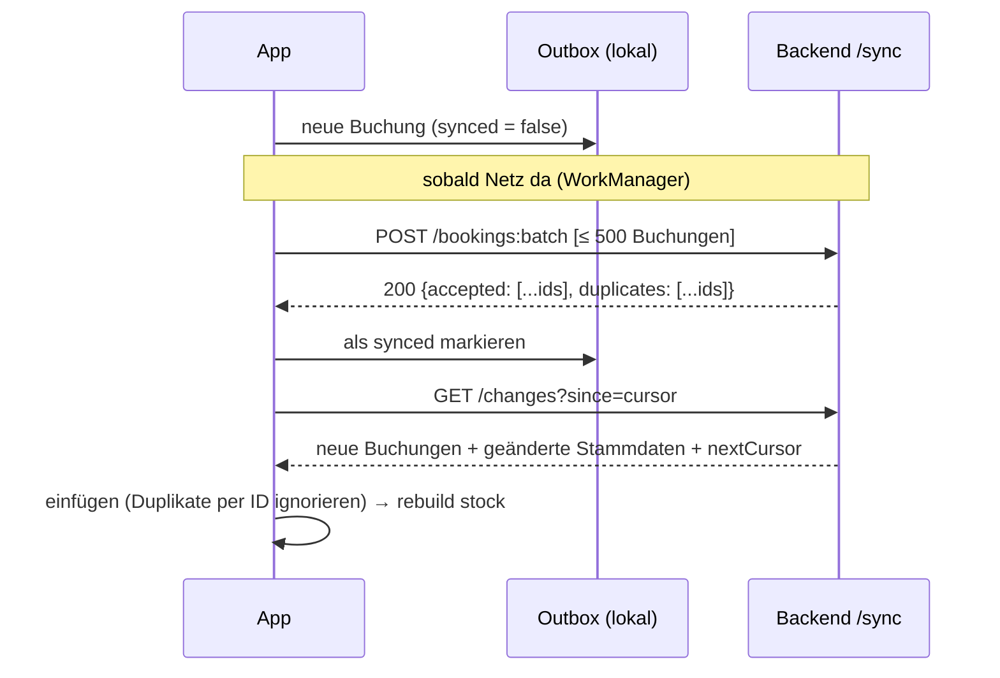

# Digital Storage Room – Architektur

> Stand: 27.09.2026 · Version 0.1 · Struktur angelehnt an arc42 (verschlankt)
> Grundlage: Feature-Katalog v0.3, User Stories MVP, Bildschirme &amp; Abläufe
> Verweise: Features (z. B. EK-2), Entscheidungen (E-x), Designentscheidungen (D-x), Architekturentscheidungen (ADR-x)
>
> This was generated with the help of Opus 5.5


## 1. Ziele und Rahmen

### 1.1 Qualitätsziele


| Prio | Ziel                                                                               | Messbar durch                                          | Bezug           |
| ---- | ---------------------------------------------------------------------------------- | ------------------------------------------------------ | --------------- |
| 1    | **Verlässlicher Bestand:** Keine Buchung geht verloren oder wird doppelt gezählt   | Absturz-/Offline-Tests, idempotenter Sync              | NF-4, NF-5      |
| 2    | **Offline-first:** Alles funktioniert ohne Netz                                    | Alle Kernabläufe im Flugmodus                          | OF-1            |
| 3    | **Schnelle Bedienung:** Scan bis Buchung ≤ 0,5 s                                   | Messung auf Referenzgerät                              | NF-1, NF-3      |
| 4    | **Erweiterbarkeit:** Backend, mehrere Geräte, iOS/Web, Hardware-Scanner ohne Umbau | Neue Quelle = neue Implementierung einer Schnittstelle | E-6, MU-\*      |
| 5    | **Testbarkeit:** Fachlogik ohne Android testbar, Datenschicht 100 % Abdeckung      | Coverage-Report                                        | requirements.md |


### 1.2 Randbedingungen

- Ein Entwickler, Freizeitprojekt: **KISS** vor Vollständigkeit. Nur bauen, was das MVP braucht. Erweiterungspunkte vorsehen, aber nicht implementieren.
- MVP: **Android**, ein Nutzer, ein Gerät, **kein Backend** (E-6).
- Später: iOS, Web, mehrere Nutzer/Haushalte, ESP32-Scanner über LoRa und ESP32-Host (E-11).
- Backend portabel als Container. Ziel offen (Home-Cluster oder Cloud).

## 2. Kontext

### 2.1 MVP



### 2.2 Zielbild



Das Backend kennt nur **eine** Buchungs-Schnittstelle. App, Web und ESP32-Host sind gleichberechtigte Quellen (ADR-5).

## 3. Lösungsstrategie


| Thema         | Ansatz                                                                                                                                                                             | ADR            |
| ------------- | ---------------------------------------------------------------------------------------------------------------------------------------------------------------------------------- | -------------- |
| Plattform     | **Kotlin Multiplatform (KMP):** Fachlogik, Daten und Sync in `shared`. UI im MVP mit Jetpack Compose (Android).                                                                    | ADR-1          |
| Datenhaltung  | **Buchungen sind ein unveränderliches Log.** Bestand und Einkaufsliste werden daraus abgeleitet (Projektion). Stammdaten (Produkte, Lagerorte) sind normale, änderbare Datensätze. | ADR-2          |
| IDs           | **UUIDs, auf dem Gerät erzeugt**                                                                                                                                                   | ADR-3          |
| Konflikte     | Buchungen sind Deltas (+n/−n) und damit **kommutativ**. Es gibt keine Konflikte. Stammdaten: Last-Writer-Wins pro Feld. **Kein Operational Transformation nötig.**                 | ADR-4          |
| Schnittstelle | **Repository-Interfaces** in `shared`, lokale Implementierung im MVP, Sync-Implementierung später. REST-API mit Batch-Upload.                                                      | ADR-5          |
| Backend       | **Ktor + PostgreSQL**, als Container. Teilt Modelle mit der App.                                                                                                                   | ADR-6          |
| Hardware      | ESP32-Host übersetzt LoRa → REST. Die API wird nicht angepasst.                                                                                                                    | ADR-7 (= E-11) |


## 4. Bausteinsicht

### 4.1 Module (Gradle)

```
digital-storage-room/
├── shared/                     ← KMP (commonMain, androidMain, später iosMain)
│   ├── domain/                 ← reines Kotlin, keine Abhängigkeiten
│   │   ├── model/              Product, StorageSpace, Booking, ShoppingEntry …
│   │   ├── projection/         StockProjection, ShoppingListProjection
│   │   ├── usecase/            ScanItem, ConsumeItem, UndoBooking, SaveCorrections …
│   │   └── repository/         Interfaces (BookingRepository, ProductRepository …)
│   ├── data/
│   │   ├── local/              Room-KMP: Entities, DAOs, Implementierung der Repositories
│   │   └── sync/               (später) SyncClient, Outbox, API-DTOs
│   └── api-contract/           ← DTOs + Serialisierung, geteilt mit dem Backend
├── androidApp/                 ← Compose-UI, ViewModels, Navigation, CameraX + ML Kit
├── backend/                    ← (später) Ktor-Server, nutzt api-contract
└── docs/                       ← features.md, stories/, architecture.md, adr/
```

**Abhängigkeitsregel:** `androidApp → shared.domain ← shared.data`. Die Domain kennt keine Datenbank, kein Android, kein Netzwerk.

### 4.2 Schichten in der App




| Baustein           | Verantwortung                                                                                                                                           |
| ------------------ | ------------------------------------------------------------------------------------------------------------------------------------------------------- |
| **Use Cases**      | Eine fachliche Aktion = ein Use Case. Prüfen Regeln (z. B. „kein Entnehmen bei Bestand 0“, EN-1 AK-3) und erzeugen Buchungen.                           |
| **Projektionen**   | Berechnen Bestand pro Produkt × Lagerort und die automatische Einkaufsliste aus Buchungen + Mindestbestand. Reine Funktionen, vollständig unit-testbar. |
| **Repositories**   | Lesen/Schreiben von Buchungen und Stammdaten. Liefern `Flow`s, damit die UI live aktualisiert (EK-2 AK-4).                                              |
| **BarcodeScanner** | Kapselt Kamera und Erkennung. Liefert „Barcode im Zielrahmen“ auf Anfrage (Scan-Button, E-7). Austauschbar für iOS und den späteren Dauerscan (SC-7).   |


## 5. Datenmodell

### 5.1 Übersicht



`HOUSEHOLD` gibt es im MVP genau einmal (lokal erzeugt). Damit ist Multi-Tenancy (MU-7) im Modell bereits angelegt.

### 5.2 Buchung (Kern)


| Feld             | Typ      | Beschreibung                                                                                           |
| ---------------- | -------- | ------------------------------------------------------------------------------------------------------ |
| `id`             | UUID     | Weltweit eindeutig, auf dem Gerät erzeugt. Dient als **Idempotenzschlüssel** beim Sync.                |
| `householdId`    | UUID     | Mandant                                                                                                |
| `productId`      | UUID     |                                                                                                        |
| `storageSpaceId` | UUID     |                                                                                                        |
| `delta`          | Int      | +n Einbuchen, −n Entnehmen. Nie 0.                                                                     |
| `type`           | Enum     | `IN`, `OUT`, `CORRECTION`, `REVERSAL`, `MOVE_OUT`, `MOVE_IN`                                           |
| `reversesId`     | UUID?    | Bei `REVERSAL`: die zurückgenommene Buchung (SC-4, EN-2)                                               |
| `correlationId`  | UUID?    | Fasst zusammengehörige Buchungen zusammen (Umlagern, Lagerort löschen, Speichern im Bearbeitungsmodus) |
| `sourceId`       | String   | Gerät, das gebucht hat (App-Installation, später ESP32-Scanner-ID)                                     |
| `occurredAt`     | Instant  | Zeitpunkt auf dem Gerät                                                                                |
| `receivedAt`     | Instant? | Zeitpunkt im Backend (später)                                                                          |


**Regeln**

- Buchungen werden **nie geändert oder gelöscht** (NF-5). Korrektur = neue Buchung.
- Umlagern und Lagerort-Verschieben (LO-4) = `MOVE_OUT` + `MOVE_IN` mit gleicher `correlationId`, in einer Transaktion.
- Bearbeitungsmodus speichern (BE-4) = eine `CORRECTION` pro geändertem Produkt mit der Differenz. Bei Differenz 0 keine Buchung (BE-4 AK-6).

### 5.3 Stammdaten


| Entität               | Wichtige Felder                                            | Hinweise                                                                                            |
| --------------------- | ---------------------------------------------------------- | --------------------------------------------------------------------------------------------------- |
| `StorageSpace`        | id, name, type, sortIndex, deletedAt?, updatedAt           | Löschen = Soft-Delete, damit alte Buchungen gültig bleiben                                          |
| `Product`             | id, name, minStock (≥ 0), photoRef?, deletedAt?, updatedAt | `minStock` steht hier (E-2)                                                                         |
| `Barcode`             | code, productId                                            | Mehrere Barcodes pro Produkt möglich (PR-1 AK-8, PR-4). Ein Barcode ist **pro Haushalt** eindeutig. |
| `ManualShoppingEntry` | id, text, productId?, quantity, checked, updatedAt         | EK-3                                                                                                |
| `ShoppingState`       | productId, checked, checkedAt                              | Abhak-Status automatischer Einträge (EK-4, E-10)                                                    |


### 5.4 Projektionen

**Bestand** (pro Produkt × Lagerort):

$$
\text{bestand}(p, l) = \sum_{b \,\in\, \text{Buchungen}(p, l)} b.\text{delta}
$$

**Einkaufsliste** (automatischer Teil, E-2):

$$
\text{fehlt}(p) = \max\left(0,\; \text{minStock}(p) - \sum_{l} \text{bestand}(p, l)\right)
$$

Ein Produkt steht auf der Liste, wenn $$\text{fehlt}(p) > 0$$. Wird $$\text{fehlt}(p) = 0$$, wird sein `ShoppingState` zurückgesetzt (EK-2 AK-5).

**Umsetzung im MVP:** Die Datenbank führt eine Tabelle `stock(productId, storageSpaceId, quantity)`. Sie wird **in derselben Transaktion** aktualisiert wie die neue Buchung. So bleiben Abfragen schnell. Die Tabelle lässt sich jederzeit aus dem Log neu berechnen (`rebuildStock()`, z. B. nach Import oder Sync). Ein Test prüft: Neuberechnung = inkrementeller Stand.

**Negativer Bestand:** Lokal verhindern die Use Cases ihn (EN-1 AK-3). Später können aber zwei Geräte offline dasselbe letzte Stück entnehmen. Die Projektion rechnet dann ehrlich mit −1. Die UI zeigt 0 und markiert „Bestand prüfen“ (Grundlage für EN-5). Buchungen werden dabei nie verworfen.

## 6. Laufzeitsicht

### 6.1 Scan im Modus Einbuchen (SC-2, PR-1)



### 6.2 Rückgängig (SC-4, EN-2)

Die UI hält pro Scan-Sitzung einen Stapel von Buchungs-IDs (D-4). „Rückgängig“ erzeugt eine `REVERSAL`-Buchung mit `delta = −original.delta` und `reversesId`. Eine Buchung kann nur einmal zurückgenommen werden (wird im Use Case geprüft).

### 6.3 Sync (später, OF-5)



- **Idempotenz:** Das Backend speichert Buchungen per `id` mit `ON CONFLICT DO NOTHING`. Ein wiederholter Upload richtet keinen Schaden an (wichtig auch für den ESP32-Host).
- **Batching:** Buchungen werden gesammelt gesendet (technical.md).
- **Cursor** = fortlaufende Server-Sequenz, nicht die Gerätezeit. So wird nichts übersehen, auch bei falsch gehenden Uhren.
- **Live-Updates** (MU-4): später per WebSocket/SSE „es gibt Neues“. Danach holt die App `GET /changes`.

### 6.4 ESP32-Scanner (später, MU-9/MU-10)


- Der Scanner sendet **Barcode statt Produkt-ID**. Er kennt keine Stammdaten. Das Backend löst den Barcode auf (OF-2 AK-5).
- **Deterministische ID** (UUIDv5 aus `scannerId + seq`): Funk-Wiederholungen erzeugen dieselbe ID und werden dadurch vom Backend verworfen.
- Der Host braucht dafür einen eigenen Endpunkt, der **Rohscans** annimmt. Die Buchungs-Schnittstelle selbst bleibt unverändert (E-11).

## 7. API-Skizze (später)


| Methode | Pfad                                         | Zweck                                         |
| ------- | -------------------------------------------- | --------------------------------------------- |
| `POST`  | `/v1/households/{id}/bookings:batch`         | Buchungen hochladen (idempotent)              |
| `GET`   | `/v1/households/{id}/changes?since={cursor}` | Buchungen + Stammdaten-Änderungen seit Cursor |
| `PUT`   | `/v1/households/{id}/products/{productId}`   | Produkt anlegen/ändern (LWW über `updatedAt`) |
| `PUT`   | `/v1/households/{id}/storage-spaces/{id}`    | Lagerort anlegen/ändern                       |
| `POST`  | `/v1/devices/{deviceId}/scans:batch`         | Rohscans von ESP32-Host                       |
| `GET`   | `/v1/households/{id}/unresolved-scans`       | Warteschlange unbekannter Barcodes            |


Beispiel-Buchung (`api-contract`, kotlinx.serialization):

```json
{
  "id": "6f1c2b7e-3a0d-4c1e-9a55-0f2d8e7b9c11",
  "productId": "b3a9...",
  "storageSpaceId": "17d2...",
  "delta": -1,
  "type": "OUT",
  "reversesId": null,
  "correlationId": null,
  "sourceId": "android-7f3e",
  "occurredAt": "2026-09-27T18:42:10.123Z"
}
```

**Versionierung:** URL-Präfix `/v1`. Neue Felder sind optional. Clients ignorieren unbekannte Felder (`ignoreUnknownKeys = true`).

## 8. Querschnittliche Konzepte


| Thema                    | Konzept                                                                                                                                                   |
| ------------------------ | --------------------------------------------------------------------------------------------------------------------------------------------------------- |
| **Reaktive UI**          | Room → `Flow` → ViewModel `StateFlow` → Compose. Keine manuellen Refreshes. Einkaufslisten-Badge, Bestand und Suche aktualisieren sich automatisch.       |
| **Transaktionen**        | Jeder Use Case, der Buchungen erzeugt, läuft in genau einer DB-Transaktion (Buchung(en) + `stock`). Grundlage für NF-4.                                   |
| **Zeit**                 | `kotlinx-datetime`, UTC speichern, lokal anzeigen. Eine `Clock` wird injiziert (testbar).                                                                 |
| **Dependency Injection** | Koin (KMP-fähig, leichtgewichtig)                                                                                                                         |
| **Suche**                | Normalisierte Namensspalte (klein, Umlaute → ae/oe/ue, ß → ss) für „kase“ → „Käse“ (BE-3 AK-2). Ergebnis mit Verteilung über Lagerorte aus `stock` (D-5). |
| **Mehrsprachigkeit**     | Strings über Compose Multiplatform Resources (oder Android `strings.xml` im MVP). Keine Texte im Code (todo.md, NF-6).                                    |
| **Fotos**                | Als Datei im App-Speicher, in der DB nur eine Referenz. Später Upload in einen Objektspeicher.                                                            |
| **Backup (OF-6)**        | Export = Buchungs-Log + Stammdaten als JSON. Import = einfügen + `rebuildStock()`. Dasselbe Format wie die API (`api-contract`).                          |
| **Sicherheit (später)**  | OIDC (z. B. Keycloak oder Entra), Mandantentrennung über `householdId` in jeder Abfrage. Geräte-Token für den ESP32-Host.                                 |


## 9. Architekturentscheidungen (ADR)

> Kurzform. Jede ADR wird bei Bedarf als eigene Datei unter `docs/adr/` abgelegt.

### ADR-1: Kotlin Multiplatform mit Compose-UI

- **Kontext:** MVP Android, später iOS/Web. Vorhandene Android-/Kotlin-Erfahrung.
- **Entscheidung:** KMP für Domain, Daten und Sync. UI im MVP mit Jetpack Compose. Compose Multiplatform für iOS wird geprüft, sobald iOS ansteht.
- **Konsequenzen:** + Fachlogik einmal schreiben und testen. + Teilen mit Backend. − Kamera/ML Kit sind plattformspezifisch (hinter Interface). − Etwas mehr Build-Komplexität.

### ADR-2: Buchungs-Log mit abgeleitetem Bestand (Eventsourcing light)

- **Kontext:** Nachvollziehbarkeit (NF-5), spätere Statistik (ST-\*), Zusammenführen mehrerer Quellen.
- **Entscheidung:** Nur **Bestandsänderungen** sind unveränderliche Events. Stammdaten sind normale Datensätze. Bestand wird als Projektion gepflegt und ist jederzeit neu berechenbar.
- **Verworfen:** Volles Eventsourcing (zu aufwendig für Stammdaten), CRUD mit Bestandszahl (keine Historie, Sync-Konflikte).
- **Konsequenzen:** + Historie und Prognosen „gratis“. + Sync ohne Konflikte. − Fehler werden durch Gegenbuchungen korrigiert, nicht durch Überschreiben.

### ADR-3: Clientseitig erzeugte UUIDs

- **Entscheidung:** Alle IDs sind UUIDs (v4 bzw. v7 für Sortierbarkeit) und werden auf dem Gerät erzeugt. ESP32-Buchungen bekommen UUIDv5 aus `scannerId + seq`.
- **Konsequenzen:** + Offline anlegen ohne Server. + Idempotenter Sync. − Etwas größere Schlüssel.

### ADR-4: Keine Operational Transformation

- **Kontext:** technical.md schlägt OT (wie Google Docs) gegen gegenseitiges Überschreiben vor.
- **Entscheidung:** **Nicht nötig.** Bestandsänderungen sind Deltas. Ihre Summe ist unabhängig von der Reihenfolge, deshalb können zwei Geräte parallel buchen, ohne sich zu überschreiben (MU-6). Für Stammdaten reicht Last-Writer-Wins pro Feld.
- **Konsequenzen:** + Deutlich einfacher. − Gleichzeitiges Umbenennen desselben Produkts: Die letzte Änderung gewinnt (akzeptabel).

### ADR-5: Repository-Interfaces als Erweiterungspunkt, Outbox für Sync

- **Entscheidung:** Use Cases kennen nur Interfaces. Im MVP gibt es die lokale Implementierung. Sync kommt später als Outbox-Muster dazu (Spalte `synced` an Buchungen) und wird per WorkManager angestoßen.
- **Konsequenzen:** + MVP enthält keinen ungenutzten Netzwerkcode. + Sync lässt sich ohne Änderung der Use Cases ergänzen.

### ADR-6: Ktor + PostgreSQL als Container

- **Entscheidung:** Backend mit Ktor (Kotlin-first, leichtgewichtig, teilt `api-contract`), PostgreSQL, ausgeliefert als Docker-Image. Lauffähig auf Raspberry Pi (arm64) und in der Cloud.
- **Verworfen:** Spring Boot (schwerer, wenig Nutzen bei diesem Umfang), BaaS (Bindung, Eventsourcing schwer umsetzbar).

### ADR-7: ESP32-Host als Gateway (= E-11)

- **Entscheidung:** LoRa endet am Host. Der Host spricht HTTPS mit einem Rohscan-Endpunkt. Die Buchungs-API bleibt unverändert.

### ADR-8: Room (KMP) als lokale Datenbank

- **Entscheidung:** Room mit KMP-Unterstützung (SQLite). Alternative: SQLDelight.
- **Begründung:** Bekannt aus der Android-Welt, Flows, Migrationen, KMP-fähig. Wird bei Problemen mit iOS neu bewertet.

## 10. Risiken und technische Schulden


| Risiko                                 | Auswirkung                                  | Maßnahme                                                                                                                    |
| -------------------------------------- | ------------------------------------------- | --------------------------------------------------------------------------------------------------------------------------- |
| Wachsendes Buchungs-Log                | Neuberechnung wird langsam                  | `stock`-Tabelle inkrementell pflegen. Später Snapshots. Bei \~10 Buchungen/Tag sind es ca. 3 650 pro Jahr, also unkritisch. |
| Barcode-Erkennung bei schlechtem Licht | NF-1 verfehlt                               | Taschenlampe (SC-2 AK-8), Zielrahmen, Messung auf echten Geräten                                                            |
| KMP-Reife für iOS (Kamera, Room)       | Mehraufwand bei iOS                         | Plattformcode hinter Interfaces. Entscheidung ADR-8 bei iOS-Start prüfen.                                                   |
| Nutzer vergessen das Entnehmen         | Bestand falsch, Einkaufsliste unzuverlässig | Fachlich: schnelle Wege (E-8, E-9). Später EN-5 „Stimmt das noch?“.                                                         |
| Schema-Änderungen nach Release         | Datenverlust                                | Room-Migrationen mit Tests. Export/Backup (OF-6) früh nachziehen.                                                           |


## 11. Offene Architekturfragen


| #   | Frage                                                                    | Vorschlag                                                  |
| --- | ------------------------------------------------------------------------ | ---------------------------------------------------------- |
| A-1 | Room-KMP oder SQLDelight?                                                | Room (ADR-8), weil vertrauter                              |
| A-2 | Compose Multiplatform schon im MVP (UI teilen) oder nur Android-Compose? | Nur Android-Compose im MVP, Wechsel ist später gut möglich |
| A-3 | UUIDv4 oder v7?                                                          | v7 (zeitlich sortierbar, hilfreich für Logs und Indizes)   |
| A-4 | Fotos im MVP überhaupt?                                                  | Ja, aber nur lokal und optional                            |


## 12. Glossar (technisch)


| Begriff        | Bedeutung                                                                         |
| -------------- | --------------------------------------------------------------------------------- |
| **Projektion** | Aus dem Buchungs-Log abgeleiteter Zustand (Bestand, Einkaufsliste)                |
| **Outbox**     | Lokale Warteschlange noch nicht synchronisierter Buchungen                        |
| **Idempotent** | Mehrfaches Senden derselben Buchung hat dieselbe Wirkung wie einmaliges           |
| **LWW**        | Last-Writer-Wins: Bei konkurrierenden Änderungen gewinnt die zuletzt geschriebene |
| **Cursor**     | Server-Sequenznummer für „gib mir alles seit …“                                   |


