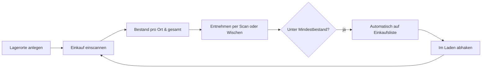

# Digital Storage Room – Feature-Katalog

> Stand: 27.09.2026 · Version 0.3 · Fokus: fachliche Features (Architektur, CI/CD und Tests folgen separat)

> This was generated with the help of Opus 5.5

## 1. Vision

Lebensmittel liegen in der Wohnung an vielen Orten: im Kühlschrank, im Vorratsschrank, im Keller, auf dem Balkon. Der **Digital Storage Room** bildet diese Orte digital ab. So weiß ich jederzeit ohne Nachsehen,

1. **was ich nachkaufen muss** (Hauptziel) und
2. **was ich habe und wo es liegt** (Überblick).

Andere Funktionen wie Haltbarkeit, Statistiken oder KI sind Zusatznutzen. Sie dürfen die beiden Hauptziele nicht verkomplizieren.

## 2. Leitprinzipien

| Prinzip | Bedeutung |
|---|---|
| **Die Einkaufsliste ist das Produkt** | Ein Feature muss am Ende eine verlässliche Einkaufsliste möglich machen. |
| **Erfassen ohne Mühe** | Der Bestand stimmt nur, wenn Einbuchen *und* Entnehmen schnell gehen. Jeder zusätzliche Klick ist ein Risiko. |
| **Offline-first** | Im Keller gibt es kein Netz. Die App muss dort trotzdem voll funktionieren. |
| **Klein anfangen** | Version 1 ist für einen Nutzer auf einem Gerät gedacht. Mehrere Nutzer und Geräte kommen später, das Datenmodell soll sie aber nicht verbauen. |

## 3. Begriffe (Glossar)

| Begriff | Bedeutung |
|---|---|
| **Lagerort** *(Storage Space)* | Digitales Abbild eines physischen Orts, z. B. Kühlschrank, Keller, Balkon. Jeder Lagerort hat einen Typ. |
| **Lagerort-Typ** | `GEKÜHLT` (Kühlschrank, kühler Keller), `TIEFGEKÜHLT` (Gefriertruhe), `RAUMTEMPERATUR` (Regal, Vorratsschrank), `DRAUSSEN` (Balkon) |
| **Produkt** *(ItemRepresentation)* | Stammdaten eines Artikels: Name, Bild, Kategorie, Nährwerte usw. Jedes Produkt hat eine eigene ID. Ein Barcode verweist auf ein Produkt, ist aber nicht zwingend eindeutig. |
| **Bestandsartikel** *(StoredItem)* | Ein konkretes, physisch vorhandenes Stück eines Produkts an einem Lagerort. Optional mit Einlagerungsdatum und Haltbarkeitsdatum. |
| **Mindestbestand** | Menge eines Produkts, die immer vorrätig sein soll. Wird sie unterschritten, muss nachgekauft werden. |
| **Einkaufsliste** | Produkte, deren Bestand unter dem Mindestbestand liegt, plus manuell ergänzte Einträge. |
| **Bestandsbuchung** | Jede Änderung am Bestand: Einbuchen, Entnehmen, Umlagern, Korrektur oder Gegenbuchung. |
| **Quelle** | Das Gerät, das eine Buchung erzeugt hat: Smartphone-App oder später ein Hardware-Scanner. |

## 4. Priorisierung

- **MVP:** Das braucht Version 1, damit das Hauptproblem gelöst ist.
- **Next:** Deutlicher Mehrwert, direkt nach dem MVP.
- **Later:** Ausbaustufen und Ideen.

## 5. Features

### 5.1 Lagerorte — MVP

| ID | Feature | Prio |
|---|---|---|
| LO-1 | Lagerorte anlegen, umbenennen und löschen | MVP |
| LO-2 | Jedem Lagerort einen Typ zuweisen (siehe Glossar) | MVP |
| LO-3 | Lagerorte sortieren, z. B. nach Laufweg in der Wohnung | Next |
| LO-4 | Ein Lagerort mit Bestand darf nur gelöscht werden, wenn der Bestand vorher umgelagert oder verworfen wird | MVP |
| LO-5 | **Lagerort DRAUSSEN:** Außentemperatur anzeigen. Liegt sie außerhalb eines sicheren Bereichs, werden gefährdete Artikel markiert und die Farbe des Lagerorts ändert sich. | Later |

### 5.2 Einbuchen per Scan — MVP

| ID | Feature | Prio |
|---|---|---|
| SC-1 | Scanner öffnen, Lagerort und Modus wählen (**Einbuchen**/**Entnehmen**) | MVP |
| SC-2 | **Scan per Auslöser:** Ein Artikel wird gebucht, wenn ich den Scan-Button tippe und ein Barcode im Bild ist. Ein Tipp entspricht genau einem Scan. | MVP |
| SC-3 | Rückmeldung pro Scan über Ton, Vibration und kurzes Einblenden von Produktname und neuer Menge | MVP |
| SC-4 | Den letzten Scan mit einem Tipp rückgängig machen | MVP |
| SC-5 | Übersicht am Ende der Scan-Sitzung: „12 Artikel in *Keller* eingebucht“ | Next |
| SC-6 | Menge beim Scan erhöhen, z. B. „6er-Pack Wasser = 6 Stück“ | Next |
| SC-7 | **Dauerscan:** Ein Artikel wird automatisch erfasst, sobald er im Bild ist, und zwar genau einmal. Erst wenn er das Bild verlässt und wieder erscheint, wird er erneut gezählt. Ersetzt optional den Auslöser (SC-2). | Next |

### 5.3 Produkte (Stammdaten) — MVP

| ID | Feature | Prio |
|---|---|---|
| PR-1 | Ist ein Barcode unbekannt, legt der Nutzer das Produkt direkt aus dem Scanner an (Name reicht, alles andere optional) | MVP |
| PR-2 | Produktdaten automatisch aus einer offenen Datenbank vorbefüllen (z. B. Open Food Facts) | Next |
| PR-3 | Produkte **ohne Barcode** anlegen und buchen (Obst, Gemüse, lose Ware, Selbstgemachtes) | MVP |
| PR-4 | Mehrere Barcodes einem Produkt zuordnen (z. B. „Milch 1,5 %“ von verschiedenen Marken als *ein* Produkt) | Next |
| PR-5 | Produkt-Detailseite mit Stammdaten, Gesamtbestand und Verteilung auf die Lagerorte | MVP |
| PR-6 | Kategorien (Milchprodukte, Konserven, Getränke …) | Next |

### 5.4 Bestand und Überblick — MVP

| ID | Feature | Prio |
|---|---|---|
| BE-1 | **Bestand pro Lagerort:** Liste der Produkte mit Menge | MVP |
| BE-2 | **Gesamtbestand über alle Lagerorte:** z. B. „Milch: 3 (1× Kühlschrank, 2× Keller)“ | MVP |
| BE-3 | Suchen sowie sortieren nach Name, Menge und Einlagerungsdatum | MVP |
| BE-4 | Menge im Bearbeitungsmodus mit **+/−** anpassen. Änderungen werden gesammelt und erst mit „Speichern“ übernommen (Schutz vor Fehltipps). | MVP |
| BE-5 | **Bestand 0 bleibt sichtbar:** Ein Produkt mit Menge 0 bleibt in der Liste und wird ausgegraut. Ausblenden lässt es sich über einen Filter oder durch Löschen. | MVP |
| BE-6 | **Umlagern** als eigene Aktion, z. B. 1× Milch vom Keller in den Kühlschrank | Next |
| BE-7 | Filtern, z. B. „nur unter Mindestbestand“, „nur Kategorie X“ | Next |

### 5.5 Entnehmen — MVP

> Hier liegt das größte Risiko: Wird das Entnehmen vergessen, stimmen Bestand und Einkaufsliste nicht mehr. Deshalb gibt es mehrere Wege, die gleich schnell sind.

| ID | Feature | Prio |
|---|---|---|
| EN-1 | **Per Scan:** Scanner im Modus „Entnehmen“ (siehe SC-1) | MVP |
| EN-2 | **Per Wischgeste:** In der Bestandsliste „Aufgebraucht“ wischen. Die Entnahme wird sofort gebucht und kann kurz rückgängig gemacht werden (E-9). | MVP |
| EN-3 | Beim Entnehmen per Scan wird der Lagerort erkannt: Liegt das Produkt nur an einem Ort, muss man keinen wählen. | Next |
| EN-4 | Homescreen-Widget „Schnell entnehmen“ (Scanner direkt im Entnahmemodus öffnen) | Later |
| EN-5 | Regelmäßige Bestandsprüfung („Stimmt das noch?“) für einzelne Lagerorte, um Abweichungen zu korrigieren | Later |

### 5.6 Mindestbestand und Einkaufsliste — MVP (Kern)

| ID | Feature | Prio |
|---|---|---|
| EK-1 | **Mindestbestand pro Produkt** festlegen (Standard: 0 = kein automatisches Nachkaufen) | MVP |
| EK-2 | **Automatische Einkaufsliste:** Liegt der Gesamtbestand unter dem Mindestbestand, kommt das Produkt auf die Liste, mit der Menge, die fehlt. | MVP |
| EK-3 | Manuelle Einträge ergänzen (auch Dinge ohne Produkt, z. B. „Geschenkpapier“) | MVP |
| EK-4 | Im Laden abhaken | MVP |
| EK-5 | **Nach dem Einkauf einbuchen:** Abgehakte Artikel mit einem Klick einem Lagerort zuordnen und einbuchen, ganz ohne Scannen | Next |
| EK-6 | Einkaufsliste nach Kategorie oder Supermarkt-Laufweg sortieren | Later |
| EK-7 | Einkaufsliste teilen oder exportieren (Text, Messenger) | Next |

### 5.7 Offline-first — MVP

| ID | Feature | Prio |
|---|---|---|
| OF-1 | Alle Kernfunktionen (Scannen, Buchen, Bestand, Einkaufsliste) funktionieren ohne Internet | MVP |
| OF-2 | Buchungen werden lokal dauerhaft gespeichert. Die Synchronisation mit einem Backend ist über eine definierte Schnittstelle vorbereitet (siehe E-6), wird aber im MVP nicht umgesetzt. | MVP |
| OF-3 | Sichtbare Statusanzeige: „3 Änderungen noch nicht synchronisiert“ | Next |
| OF-4 | Unbekannte Barcodes ohne Netz werden vorläufig angelegt und bei Verbindung mit der Produktdatenbank abgeglichen | Next |
| OF-5 | Automatische Synchronisation mit dem Backend, sobald eine Verbindung besteht | Next |
| OF-6 | Lokale Datensicherung und Wiederherstellung (Export/Import), solange es kein Backend gibt | Next |

### 5.8 Haltbarkeit — Next

| ID | Feature | Prio |
|---|---|---|
| HA-1 | Optional ein Haltbarkeitsdatum pro Bestandsartikel erfassen | Next |
| HA-2 | Hinweis bzw. Benachrichtigung: „Läuft in 3 Tagen ab“ | Next |
| HA-3 | Beim Entnehmen den Artikel vorschlagen, der zuerst abläuft (First-Expired-First-Out) | Later |
| HA-4 | Aktion „Weggeworfen“ als eigener Entnahmegrund (Grundlage für Statistik) | Later |

### 5.9 Verlauf, Statistik und Prognose — Later

| ID | Feature | Prio |
|---|---|---|
| ST-1 | Buchungshistorie pro Produkt und Lagerort: wann was ein- und ausgebucht wurde | Next |
| ST-2 | Verlauf des Bestands als Grafik | Later |
| ST-3 | **Verbrauchsprognose:** „Milch geht in ca. 3 Tagen aus“, frühzeitig auf die Einkaufsliste setzen | Later |
| ST-4 | Mindestbestand anhand des Verbrauchs vorschlagen | Later |
| ST-5 | Preise erfassen und Preisverlauf pro Produkt anzeigen | Later |

### 5.10 Mehrere Nutzer, Geräte und Haushalte — Later

> In Version 1 nicht enthalten. Das Datenmodell soll so gebaut werden, dass diese Features später ohne Umbau möglich sind.

| ID | Feature | Prio |
|---|---|---|
| MU-1 | Login und eigenes Konto | Later |
| MU-2 | **Haushalt:** mehrere Personen und Geräte teilen sich einen Digital Storage Room | Later |
| MU-3 | Mitglieder in einen Haushalt einladen oder daraus entfernen | Later |
| MU-4 | Änderungen erscheinen live auf allen Geräten des Haushalts | Later |
| MU-5 | Anzeige, wer oder welches Gerät eine Buchung gemacht hat | Later |
| MU-6 | Gleichzeitige Änderungen gehen nicht verloren (z. B. zwei Personen buchen parallel offline) | Later |
| MU-7 | Mehrere unabhängige Haushalte auf der Plattform (Multi-Tenancy), strikt getrennte Daten | Later |
| MU-8 | Weitere Plattformen: iOS, Web | Later |
| MU-9 | **Hardware-Scanner:** Kleine ESP32-Geräte mit eingebautem Barcode-Scanner, fest einem Lagerort zugeordnet (z. B. im Keller). Sie buchen ohne Smartphone ein und aus. | Later |
| MU-10 | **Funkanbindung der Hardware-Scanner** über LoRa/LoRaWAN, damit Scans auch durch dicke Wände funktionieren (z. B. im Keller eines Mehrfamilienhauses). Ein **ESP32-Host** mit WLAN empfängt die Funk-Nachrichten der Scanner, bereitet sie auf und sendet sie über die normale Backend-API (E-11). | Later |

### 5.11 KI-Funktionen — Later

| ID | Feature | Prio |
|---|---|---|
| KI-1 | Produkte automatisch kategorisieren | Later |
| KI-2 | Bild für Produkte ohne Foto generieren | Later |
| KI-3 | Rezeptvorschläge aus dem aktuellen Bestand, vorrangig mit Artikeln, die bald ablaufen | Later |

## 6. Nicht-funktionale Anforderungen (fachlich)

| ID | Anforderung |
|---|---|
| NF-1 | **Scan-Geschwindigkeit:** ≤ 0,5 s vom Tipp auf den Scan-Button bis zur Buchung |
| NF-2 | **Keine Doppelscans:** Ein Tipp auf den Scan-Button erzeugt höchstens eine Buchung (beim späteren Dauerscan SC-7: ein Artikel, der im Bild bleibt, wird nicht mehrfach gezählt) |
| NF-3 | **Entnehmen in ≤ 2 Interaktionen** ab App-Start (die App startet im Scanner, E-8) |
| NF-4 | **Keine Datenverluste** bei fehlender Verbindung oder Absturz |
| NF-5 | **Nachvollziehbarkeit:** Jede Bestandsänderung ist als Buchung dokumentiert. Korrekturen erfolgen durch neue Buchungen, nicht durch Überschreiben. |
| NF-6 | **Mehrsprachigkeit:** Texte lassen sich übersetzen (zunächst Deutsch, später Englisch) |

## 7. MVP auf einen Blick

**MVP-Umfang:** LO-1, LO-2, LO-4 · SC-1 bis SC-4 · PR-1, PR-3, PR-5 · BE-1 bis BE-5 · EN-1, EN-2 · EK-1 bis EK-4 · OF-1, OF-2 · NF-1 bis NF-5

## 8. Getroffene Entscheidungen

| # | Thema | Entscheidung | Auswirkung |
|---|---|---|---|
| E-1 | Mengen und Einheiten | Es wird **nur in Stück/Packungen** gezählt. Gewicht und Volumen sind nicht vorgesehen. | Einfache Bedienung (+/−, ein Scan = 1). Ein 6er-Pack zählt über SC-6 als 6 Stück oder als 1 Packung, je nach Produkt. |
| E-2 | Mindestbestand | Gilt **pro Produkt über alle Lagerorte**. | EK-1/EK-2 vergleichen den Gesamtbestand (BE-2) mit dem Mindestbestand. Wo der Artikel liegt, ist für die Einkaufsliste egal. |
| E-3 | Angebrochene Packungen | **Eine Packung zählt als 1, bis sie leer ist.** Erst dann wird sie entnommen. | Kein Füllstand, kein Status „angebrochen“. Soll früher nachgekauft werden, erhöht man den Mindestbestand. |
| E-4 | Externe Produktdatenbank | **Ja, nach dem MVP** (PR-2, Prio Next), z. B. Open Food Facts. | Im MVP legt der Nutzer unbekannte Produkte selbst an (PR-1). Lizenz (ODbL) und Offline-Cache werden bei PR-2 geklärt. |
| E-5 | Einbuchen ohne Scan | **Einkaufsliste → Lagerort reicht** als Alternative (EK-5, Prio Next). | Im MVP wird per Scan oder mit + eingebucht. Danach geht der Wocheneinkauf auch ganz ohne Kamera. |
| E-6 | Backend im MVP | **Kein Backend im MVP**, die App arbeitet rein lokal. Die Schnittstellen werden aber schon jetzt so definiert, dass später Backend, mehrere Nutzer, Geräte und Hardware-Scanner (MU-9) andocken können. | Jede Buchung ist ein eigenständiges Ereignis mit eindeutiger ID, Zeitpunkt, Lagerort und Quelle. So lassen sich Buchungen später unabhängig von ihrer Quelle übertragen und zusammenführen. |
| E-7 | Scannen im MVP | **Scan per Auslöser-Button** statt Dauerscan. Der Dauerscan kommt später als SC-7. | Einfacher und robuster. Doppelscans sind ausgeschlossen, ganz ohne Erkennungslogik. |
| E-8 | Einstieg in die App | **Die App startet direkt im Scanner** (mit zuletzt genutztem Lagerort und Modus). | Entnehmen und Einbuchen sind ab App-Start in ≤ 2 Tipps erreichbar (NF-3). |
| E-9 | Entnehmen per Wischen vs. Bearbeiten | **Wischen „Aufgebraucht“ bucht sofort** (mit Rückgängig). **+/− im Bearbeitungsmodus erst nach Speichern.** | Schneller Alltagsweg und geschützte Korrektur sind getrennt. |
| E-10 | Abgehakte Einträge | **Abgehakte automatische Einträge bleiben auf der Liste**, bis der Bestand durch Einbuchen wieder reicht. | Die Liste zeigt nach dem Einkauf, was noch einzuräumen ist. |
| E-11 | Anbindung Hardware-Scanner | **Die Backend-API wird nicht an LoRa angepasst.** Ein ESP32-Host dient als Gateway: Er empfängt die Funk-Nachrichten und sendet sie als normale Buchungen über WLAN an das Backend. | Die geringe Nachrichtengröße betrifft nur das Protokoll zwischen Scanner und Host. Das Backend sieht den Host wie jede andere Quelle. Die ID des ursprünglichen Scanners wird trotzdem als Quelle mitgegeben. |

## 9. Offene Fragen

*Aktuell keine. Neue Fragen werden hier gesammelt.*
