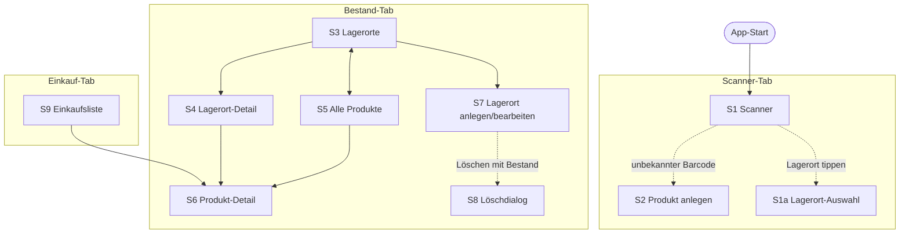
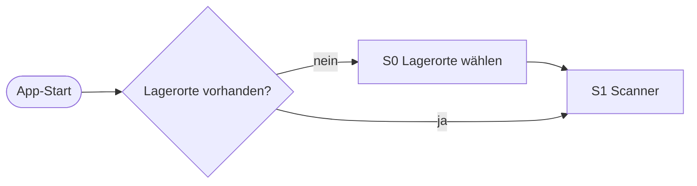
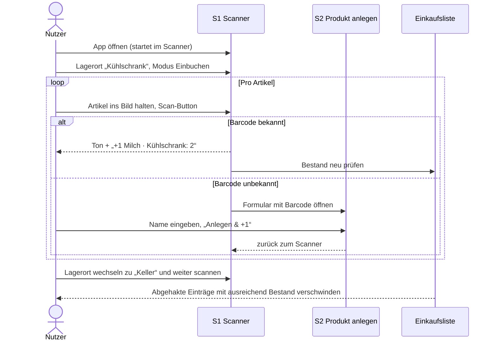
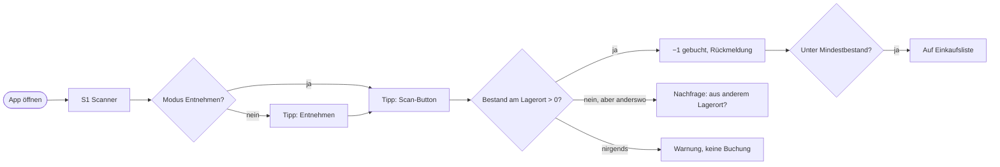
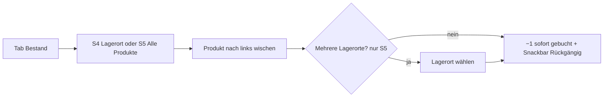
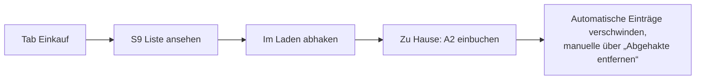
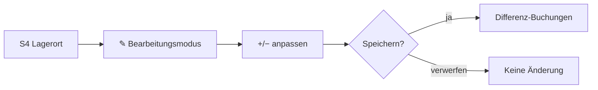

# Digital Storage Room – Bildschirme und Abläufe (MVP)

> Stand: 27.09.2026 · Grundlage: Feature-Katalog v0.3, User Stories MVP · Designfragen D-1 bis D-5 entschieden
>
> Skizzen auf Wireframe-Niveau: Es geht um Inhalt, Anordnung und Abläufe, nicht um das Design. Verweise in Klammern zeigen auf Features/Stories, z. B. (SC-2).
>
> This was generated with the help of Opus 5.5
## 1. Navigationsstruktur

Die App hat drei Hauptbereiche in einer **Bottom-Navigation**. Sie **startet immer im Scanner** (E-8).

```
┌─────────────────────────────────────────┐
│                                         │
│              (Inhalt)                   │
│                                         │
├─────────────┬─────────────┬─────────────┤
│  ⌖ Scanner  │  ▤ Bestand  │ 🛒 Einkauf 3 │
└─────────────┴─────────────┴─────────────┘
```

| Tab | Inhalt | Badge |
|---|---|---|
| **Scanner** | Start-Bildschirm, Ein- und Ausbuchen | – |
| **Bestand** | Lagerorte, Alle Produkte, Produktdetails | – |
| **Einkauf** | Einkaufsliste | Anzahl offener Einträge |

Einstellungen (Sprache, später Backup OF-6) liegen hinter einem ⚙-Symbol oben im Bestand-Tab.



## 2. Bildschirme

### S0 – Erster Start (Onboarding)

Beim allerersten Start existiert kein Lagerort. Statt des Scanners erscheint ein kurzer Einstieg (LO-1 AK-6, SC-1 AK-7).

```
┌─────────────────────────────────────────┐
│                                         │
│        Willkommen im                    │
│        Digital Storage Room             │
│                                         │
│  Wo lagerst du deine Lebensmittel?      │
│  Wähle aus oder füge eigene hinzu:      │
│                                         │
│  [✓ Kühlschrank   ] GEKÜHLT             │
│  [  Gefriertruhe  ] TIEFGEKÜHLT         │
│  [✓ Vorratsschrank] RAUMTEMPERATUR      │
│  [✓ Keller        ] GEKÜHLT             │
│  [  Balkon        ] DRAUSSEN            │
│  [ + Eigener Lagerort ]                 │
│                                         │
│         [    Los geht's    ]            │
└─────────────────────────────────────────┘
```

- Vorschläge sind **nur Vorlagen**, Name und Typ bleiben änderbar.
- Mindestens ein Lagerort muss gewählt sein.
- *Neu gegenüber den Stories:* Die Vorschlagsliste ist ein Komfort-Detail zu LO-1 und verkürzt den Einstieg deutlich.

### S1 – Scanner (Start-Bildschirm)

(SC-1 bis SC-4, EN-1, E-7, E-8)

```
┌─────────────────────────────────────────┐
│  📍 Keller           ▾        🔦        │  ← Lagerort (tippen = wechseln), Taschenlampe
│ ┌─────────────────────────────────────┐ │
│ │ [ + Einbuchen ] [ − Entnehmen ]     │ │  ← Modus-Umschalter, farbig
│ └─────────────────────────────────────┘ │
│ ┌─────────────────────────────────────┐ │
│ │                                     │ │
│ │          Kamerabild                 │ │
│ │       ┌───────────────┐             │ │
│ │       │  Zielrahmen   │             │ │
│ │       └───────────────┘             │ │
│ │                                     │ │
│ └─────────────────────────────────────┘ │
│ ┌─────────────────────────────────────┐ │
│ │ ✓ +1  Milch 1,5 %   Keller: 3       │ │  ← Rückmeldung (SC-3), ca. 2 s
│ └─────────────────────────────────────┘ │
│                                         │
│   ↶ Rückgängig       (  ◉  )            │  ← Rückgängig (SC-4) + großer Scan-Button
│                                         │
│   Diese Sitzung: 7 Artikel              │
├─────────────┬─────────────┬─────────────┤
│  ⌖ Scanner  │  ▤ Bestand  │ 🛒 Einkauf 3 │
└─────────────┴─────────────┴─────────────┘
```

**Verhalten**
- **Modusfarbe** färbt Rahmen und Scan-Button: Einbuchen = grün, Entnehmen = rot (SC-1 AK-5).
- **Scan-Button** unten mittig, mit dem Daumen erreichbar. Ein Tipp = ein Scan (SC-2).
- **Rückgängig** nimmt die Scans dieser Sitzung nacheinander zurück (SC-4). Er ist nur aktiv, wenn es etwas zurückzunehmen gibt.
- **Sitzungszähler** gibt ein Gefühl für Fortschritt. Eine „Sitzung“ endet, wenn ich den Tab wechsle oder die App schließe (Vorstufe zu SC-5).
- Lagerort und Modus werden beim nächsten Start wiederhergestellt (SC-1 AK-3).

**Zustände**

| Zustand | Anzeige |
|---|---|
| Kein Barcode erkannt | Rückmeldung grau: „Kein Barcode erkannt“ |
| Entnehmen, Bestand hier 0, anderswo vorhanden | Dialog: „Nicht im *Keller*. Aus *Kühlschrank* (2) entnehmen?“ [Ja] [Abbrechen] (EN-1 AK-2) |
| Entnehmen, nirgends Bestand | Rückmeldung rot + Warnvibration: „Milch ist nicht im Bestand“ |
| Entnehmen, unbekannter Barcode | Rückmeldung rot: „Produkt unbekannt – nicht im Bestand“ (PR-1 AK-5) |
| Einbuchen, unbekannter Barcode | → S2 |
| Keine Kameraberechtigung | Erklärung + [Berechtigung erteilen] statt Kamerabild |

### S1a – Lagerort-Auswahl (Bottom Sheet)

```
┌─────────────────────────────────────────┐
│  Lagerort wählen                        │
│  ○ ❄ Kühlschrank                  12    │
│  ● ❄ Keller                       31    │
│  ○ ▢ Vorratsschrank               24    │
│  ○ ☀ Balkon                        4    │
└─────────────────────────────────────────┘
```

Ein Tipp wählt aus und schließt das Sheet. Rechts steht die Artikelanzahl (BE-1 AK-4).

### S2 – Produkt anlegen (Bottom Sheet über dem Scanner)

(PR-1)

```
┌─────────────────────────────────────────┐
│  Neues Produkt                          │
│  Barcode: 4 012345 678901               │
│                                         │
│  Name *    [ Haferdrink Barista      ]  │
│  Foto      [ 📷 Foto aufnehmen ]        │
│  Mindestbestand   [ − ]  0  [ + ]       │
│                                         │
│  ─── oder ───                           │
│  [ Bestehendem Produkt zuordnen… ]      │  ← PR-1 AK-8
│                                         │
│  [ Abbrechen ]      [ Anlegen & +1 ]    │
└─────────────────────────────────────────┘
```

- Die Tastatur öffnet sich sofort im Namensfeld.
- „Anlegen & +1“ bucht direkt am aktuellen Lagerort ein und kehrt zum Scanner zurück (PR-1 AK-3).
- Beim Tippen schlägt die App ähnliche bestehende Produkte vor (PR-3 AK-5).

### S3 – Bestand: Lagerorte

(LO-1, LO-2, BE-1 AK-4)

```
┌─────────────────────────────────────────┐
│  Bestand                           ⚙    │
│  [ Lagerorte ] [ Alle Produkte ]        │  ← Umschalter S3 ⇄ S5
│  🔍 Suchen …                            │
│                                         │
│  ❄  Kühlschrank                   12  › │
│      2 unter Mindestbestand             │
│  ❄  Keller                        31  › │
│  ▢  Vorratsschrank                24  › │
│      1 unter Mindestbestand             │
│  ☀  Balkon                         4  › │
│                                         │
│                               ( + )     │  ← Lagerort anlegen (S7)
├─────────────┬─────────────┬─────────────┤
│  ⌖ Scanner  │  ▤ Bestand  │ 🛒 Einkauf 3 │
└─────────────┴─────────────┴─────────────┘
```

- Die Suche durchsucht **alle** Produkte und wechselt dabei automatisch zu S5 (D-5). Jeder Treffer zeigt, **wo** das Produkt liegt, siehe Suchergebnis in S5.
- Langes Drücken oder ⋯ auf einem Lagerort → Bearbeiten/Löschen (S7/S8).

### S4 – Lagerort-Detail

(BE-1, BE-3, BE-4, BE-5, EN-2)

```
┌─────────────────────────────────────────┐
│  ‹  ❄ Keller                  ✎   ⋯    │  ← ✎ = Bearbeitungsmodus (BE-4)
│  🔍 Suchen …          Sortierung: Name ▾│
│                                         │
│  Apfelsaft                          4   │
│  Mehl Type 405                      2   │
│  Milch 1,5 %                   🛒   1   │  ← unter Mindestbestand
│  Passierte Tomaten                  6   │
│  Wasser still                       9   │
│  ░ Haferflocken                    0 ░  │  ← ausgegraut, am Ende (BE-5)
│                                         │
│  ☐ Leere ausblenden                     │
│                                         │
│                               ( ⌖ )     │  ← Scanner für diesen Lagerort (BE-1 AK-3)
├─────────────┬─────────────┬─────────────┤
│  ⌖ Scanner  │  ▤ Bestand  │ 🛒 Einkauf 3 │
└─────────────┴─────────────┴─────────────┘
```

**Wischen nach links = „Aufgebraucht“ (EN-2)**

```
│  Milch 1,5 %  ◀━━━━━━━━━━━━  [ −1 Aufgebraucht ] │
...
┌─────────────────────────────────────────┐
│ 1× Milch 1,5 % entnommen   [Rückgängig] │  ← Snackbar, ca. 5 s
└─────────────────────────────────────────┘
```

**Bearbeitungsmodus (BE-4)**

```
┌─────────────────────────────────────────┐
│  ✕  Keller bearbeiten      [ Speichern ]│
│                                         │
│  Apfelsaft             [−]  4  [+]      │
│  Mehl Type 405         [−]  3• [+]      │  ← • = ungespeichert
│  Milch 1,5 %           [−]  1  [+]      │
│  Haferflocken          [−̶]  0  [+]      │  ← − deaktiviert bei 0
│                                         │
│  [ + Produkt hinzufügen ]               │  ← PR-3 (ohne Barcode)
└─────────────────────────────────────────┘
```

- ✕ mit ungespeicherten Änderungen → „Änderungen verwerfen?“ (BE-4 AK-4)
- Wischen ist im Bearbeitungsmodus deaktiviert, damit die zwei Wege sich nicht vermischen (E-9).

### S5 – Bestand: Alle Produkte

(BE-2, BE-3, BE-5)

```
┌─────────────────────────────────────────┐
│  Bestand                           ⚙    │
│  [ Lagerorte ] [ Alle Produkte ]        │
│  🔍 Suchen …          Sortierung: Name ▾│
│                                         │
│  Apfelsaft                          4   │
│    Keller 4                             │
│  Milch 1,5 %                   🛒   3   │
│    Kühlschrank 1 · Keller 2             │
│  Butter                        🛒   0   │  ← ausgegraut
│                                         │
│  Nichts gefunden?                       │
│  [ + „Äpfel“ als Produkt anlegen ]      │  ← BE-3 AK-5
├─────────────┬─────────────┬─────────────┤
│  ⌖ Scanner  │  ▤ Bestand  │ 🛒 Einkauf 3 │
└─────────────┴─────────────┴─────────────┘
```

**Suchergebnis (D-5):** Jeder Treffer nennt die Lagerorte mit Menge und Typ-Symbol, damit ich sofort sehe, ob ich in den Keller oder nur zum Kühlschrank laufen muss.

```
│  🔍 milch                          ✕    │
│                                         │
│  Milch 1,5 %                        3   │
│    ❄ Kühlschrank 1 · ❄ Keller 2         │
│  Hafermilch                         1   │
│    ▢ Vorratsschrank 1                   │
│  Buttermilch                   🛒   0   │
│    nirgends vorrätig                    │
```

- Lagerorte in der Trefferzeile folgen der Reihenfolge der Lagerortübersicht.
- Ein Tipp auf einen Lagerort in der Trefferzeile öffnet direkt S4.
- Wischen „Aufgebraucht“ geht auch hier. Liegt das Produkt an mehreren Orten, fragt die App nach, aus welchem Lagerort (EN-2 AK-3).

### S6 – Produkt-Detail

(PR-5, EK-1)

```
┌─────────────────────────────────────────┐
│  ‹  Milch 1,5 %                    ⋯    │  ← ⋯: Bearbeiten, Barcode zuordnen, Löschen
│  ┌───────┐                              │
│  │ Foto  │   Gesamt: 3                  │
│  └───────┘   Mindestbestand: [−] 4 [+]  │
│                                         │
│  🛒 Steht auf der Einkaufsliste (1)     │
│                                         │
│  Verteilung                             │
│  ❄ Kühlschrank                      1   │
│  ❄ Keller                           2   │
│                                         │
│  Barcodes                               │
│  4 012345 678901                        │
└─────────────────────────────────────────┘
```

- Der Mindestbestand lässt sich direkt hier ändern, die Einkaufsliste passt sich sofort an (EK-1 AK-4).
- Ein Tipp auf einen Lagerort öffnet S4.
- *Später:* Hier landen Buchungshistorie (ST-1) und Haltbarkeit (HA-1).

### S7 – Lagerort anlegen/bearbeiten

(LO-1, LO-2)

```
┌─────────────────────────────────────────┐
│  Neuer Lagerort                         │
│  Name *   [ Keller                   ]  │
│  Typ      (●) ▢ Raumtemperatur          │
│           ( ) ❄ Gekühlt                 │
│           ( ) ❄❄ Tiefgekühlt            │
│           ( ) ☀ Draußen                 │
│                                         │
│  [ Abbrechen ]          [ Speichern ]   │
│                                         │
│  (beim Bearbeiten:)  🗑 Lagerort löschen │
└─────────────────────────────────────────┘
```

### S8 – Lagerort löschen (Dialog)

(LO-4)

```
┌─────────────────────────────────────────┐
│  „Keller“ löschen?                      │
│  Hier liegen noch 31 Artikel.           │
│                                         │
│  (●) In anderen Lagerort verschieben    │
│        [ Kühlschrank           ▾ ]      │
│  ( ) Bestand verwerfen                  │
│                                         │
│  [ Abbrechen ]        [ Löschen ]       │
└─────────────────────────────────────────┘
```

Ohne Bestand genügt eine einfache Bestätigung. Ist „Keller“ der einzige Lagerort, gibt es nur „Verwerfen“.

### S9 – Einkaufsliste

(EK-2, EK-3, EK-4, E-10)

```
┌─────────────────────────────────────────┐
│  Einkaufsliste                     ⋯    │  ← ⋯: Abgehakte entfernen
│  [ + Eintrag hinzufügen …            ]  │  ← EK-3, schlägt Produkte vor
│                                         │
│  ☐  Milch 1,5 %                 1 ⟳     │  ← ⟳ = automatisch (EK-2 AK-6)
│  ☐  Butter                      2 ⟳     │
│  ☐  Geschenkpapier              1       │  ← manuell
│                                         │
│  Im Wagen                               │
│  ☑  Passierte Tomaten           2 ⟳     │  ← bleibt bis eingebucht (E-10)
│  ☑  Kaffee                      1       │
│                                         │
├─────────────┬─────────────┬─────────────┤
│  ⌖ Scanner  │  ▤ Bestand  │ 🛒 Einkauf 3 │
└─────────────┴─────────────┴─────────────┘
```

- **Ein Tipp** auf die ganze Zeile hakt ab bzw. hebt das Abhaken auf. Große Zielfläche für die Bedienung mit einer Hand im Laden (EK-4 AK-2).
- **Automatische Einträge** zeigen die fehlende Menge. Die Menge ist nicht editierbar, weil sie sich aus dem Bestand ergibt. Wer mehr braucht, erhöht den Mindestbestand (Tipp → S6) oder fügt einen manuellen Eintrag hinzu (EK-3 AK-4).
- **Abgehakte automatische Einträge** verschwinden von selbst, sobald zu Hause eingebucht ist (EK-2 AK-5). „Abgehakte entfernen“ entfernt nur manuelle.
- **Leerer Zustand:** „Alles da! 🎉 Nichts nachzukaufen.“ Der Hinweis erklärt außerdem, dass Produkte mit Mindestbestand automatisch auftauchen.

## 3. Abläufe

### A1 – Erster Start



### A2 – Wocheneinkauf einbuchen



### A3 – Entnehmen per Scan (Alltag, ≤ 2 Tipps)



### A4 – Entnehmen per Wischen (Verpackung schon weg)



### A5 – Einkaufen gehen



### A6 – Bestand korrigieren



## 4. Designentscheidungen

| # | Frage | Entscheidung |
|---|---|---|
| D-1 | Onboarding mit Vorschlagsliste (S0)? | **Ja.** Beim ersten Start werden Lagerorte aus einer Vorschlagsliste gewählt. Name und Typ bleiben änderbar. |
| D-2 | Zusätzliche Liste „Zuletzt verwendet“ im Scanner? | **Nein im MVP.** NF-3 ist über den Scan-Weg erfüllt. Nach ersten Erfahrungen neu bewerten. |
| D-3 | Menge automatischer Einkaufslisten-Einträge änderbar? | **Nein.** Stattdessen Mindestbestand anpassen oder manuellen Eintrag ergänzen (siehe S9). |
| D-4 | Wann endet eine Scan-Sitzung? | **Beim Verlassen des Scanner-Tabs oder Schließen der App.** Danach werden Sitzungszähler und Rückgängig zurückgesetzt. |
| D-5 | Eine Suche für alles? | **Ja.** Jeder Treffer zeigt zusätzlich, **an welchen Lagerorten** das Produkt liegt und wie viel dort ist (z. B. „❄ Kühlschrank 1 · ❄ Keller 2“), damit klar ist, wohin man laufen muss. |

## 5. Offene Designfragen

*Aktuell keine.*
